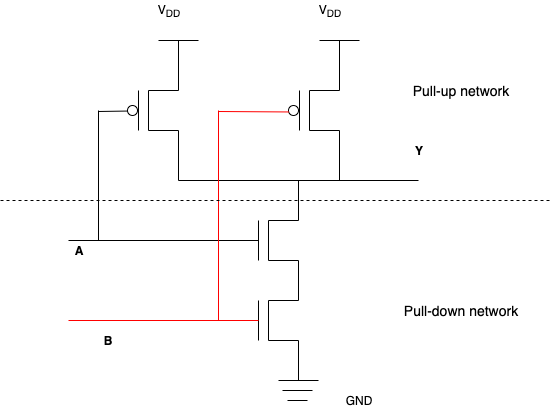

## Transistor

Transistor là thiết bị bán dẫn (semiconductor) hoạt động như là một controlled switch hay một amplifier control (thiết bị khuếch tán tín hiệu - time-varying current or voltage). Transistor điều khiển dòng điện giống như cách vòi nước điều khiển dòng nước trong nhà bạn. Với vòi nước, bạn sử dụng khoá để điều khiển dòng nước. Với transistor, một mức nhỏ voltage và/hoặc current (dòng điện) được áp dụng vào một terminal - control lead sẽ điều khiển một dòng điện lớn hơn đi qua hai terminals - other leads khác. Như vậy mọi transistor sẽ có 3 terminal, một dùng để điều khiển, còn lại để cho dòng chạy qua.

Có 2 nhóm transistor là: Bipolar transistor và Field-effect transistor (FET). Trong khi Bipolar cần một dòng doping tại control lead thì FET sử dụng một voltage - không dòng. Đại diện cho FET là MOSFET. Chúng ta sẽ tìm hiểu Bipolar trước.

Một NPN transistor được cấu tạo như hình vẽ, gồm ba thành phần bán dẫn: bán dẫn loại P ở giữa 2 bán dẫn loại N. Tuỳ theo nguyên tố được pha trộn vào Silicon mà hình thành bán dẫn loại N hay P. Nếu sử dụng Photpho - có hoá trị 5 - thì trong chất bán dẫn sẽ có electron tự do dư thừa tạo nên loại N (Negative), còn sử dụng Bo - có hoá trị 3 - thì trong chất bán dẫn sẽ có lỗ trống điện tích dương, từ đó thu hút electron tạo nên loại P (Positive).

Bình thường dòng điện sẽ không thể đi qua được transistor, E và C không kết nối. Khi có một dòng nhỏ có thể phá vỡ lực giữa vùng tiếp xúc N-P-N thì nó có thể cho dòng điện chạy qua transistor, E và C kết nối. IC/ IB thường = 100 hay tuỳ thuộc từng transistor.

## MOSFET

MOSFET - Metal Oxide Semiconductor Field Effect Transistor là một loại transistor sử dụng voltage để điều khiển (giảm điện trở và cho phép dòng điện chạy qua 2 cực) dòng điện chạy qua nó thay vì sử dụng một dòng điện khác như transistor thông thường (NPN, hay PNP, Base Emitter and Collector). Cũng do vậy MOSFET được coi là voltage-controlled switch.

Một MOSFET hoạt động như một voltage-controlled switch, trong đó gate voltage tạo ra một trường điện, trường điện này sẽ turn ON hay OFF dòng điện kết nối source và drain. Từ khoá field effect từ đó mà ra.

Chúng ta sẽ tìm hiểu hoạt động của nMOS. Thông thường substrate của nMOS sẽ nối với GND - điện áp (voltage) thấp nhất của hệ thống. Khi voltage ở gate là 0V, dòng điện sẽ không thể đi qua source và drain (no path) do diodes giữa source và drain với substract là reverse biased. Khi áp một điện áp dương vào top plate của gate, lúc này 2 plate của gate đóng vai trò như tụ điện, nó sinh ra một trường điện hấp dẫn điện tích dương ở top plate và điện tích âm ở bottom plate. Nếu voltage đủ lớn, khi đó rất nhiều điện tích âm được tích tụ ở mặt dưới của gate, vùng này chuyển đổi p-type to n-type và được gọi là *channel*. Lúc này transistor có một đường liên tục từ n-type *source* tới n-type *drain*, do đó electrons có thể chạy từ source tới drain, transistor is ON. Điện áp đủ để bật transistor gọi là *threshhold voltage, Vt*, và thường từ 0.3 đến 0.7V.

pMOS hoạt động theo cách ngược lại. Substrate được nối với điện áp Vdd - điện áp cao cấp được cấp. Khi voltage ở gate là Vdd, pMOS is OFF. Khi voltage ở gate là GND, vùng channel invert thành p-type, lúc này pMOS is ON.

## CMOS

CMOS - Complementary Metal-Oxide-Semiconductor used to product logic gates.

CMOS được hình thành bằng cách phối hợp (complementing) mỗi nMOS với một pMOS, nối 2 gates và 2 drain lại với nhau. Khi áp một high voltage ở gate sẽ làm cho nMOS dẫn điện còn pMOS không dẫn, với một low voltage ở gate sẽ gây hiệu ứng ngược lại. Cách sắp xếp này làm giảm điện năng tiêu thụ và nhiệt phát sinh (???).

pMOS ở trên và nMOS ở dưới như hình vẽ, source của pMOS nối với supply voltage, source của nMOS nối với ground. Khi voltage tại input là thấp, nMOS transistor channel ở trạng thái trở kháng (điện trở) cao và không cho phép dòng điện đi từ OUT tới ground, trở kháng ở pMOS là thấp và cho phép dòng đi từ supply tới OUT. Voltage ở OUT sẽ gần bằng ở supply, high voltage.

Ngược lại khi voltage tại input là cao, nMOS is ON, pMOS is OFF. Voltage ở OUT gần thấp bằng ground, low voltage.

Tóm lại với CMOS, khi input là thấp thì output là cao, khi input là cao thì output là thấp. Do đó CMOS được gọi là inverter. Cũng vì vậy CMOS được dùng để tạo ra mạch logic NOT - NOT gate.

## Build Logic Gate

CMOS dùng để tạo NOT gate. Chúng ta sẽ tìm hiểu cách tạo ra NAND gate (NOT AND)

Như hình vẽ, ta có thể thấy cổng NAND gồm 2 phần pull-up và pull-down network.

* pull-up network cung cấp high voltage ouput (giảm điện trở giữa Vdd và output)
* pull-down network cung cấp low voltage output (giảm điện trở giữa output và ground)

pull-up network gồm 2 pMOS nối theo kiểu song song, còn pull-down network gồm 2 nMOS nối liên tiếp nhau. Dựa vào mô hình mạch như trên, ta có bảng hoạt động của NAND gate như sau:

| A  | B  | Pull-down network | Pull-up network | Y  |
|----|:---|:------------------|:----------------|:---|
| 0  | 0  | OFF               | ON              | 1  |
| 0  | 1  | OFF               | ON              | 1  |
| 1  | 0  | OFF               | ON              | 1  |
| 1  | 1  | ON                | OFF             | 1  |

* 1: High voltage
* 0: Low voltage

Phần trên mô tả 2-input NAND gate, tổng quát hoá chúng ta có thể xây dựng n-input NAND gate hay gọi là inverting logic gate như sau:

Từ NOT và NAND gate, chúng ta có thể xây dựng các mạch logic phức tạp hơn. Chúng ta sẽ tìm hiểu thêm trong bài viết về Logic gate.

## Reference

Digital Design and Computer Architecture - Sarad Harris, David Harris

https://en.wikipedia.org/wiki/CMOS

https://www.youtube.com/watch?v=_SwY-WfWTQo