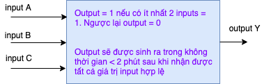
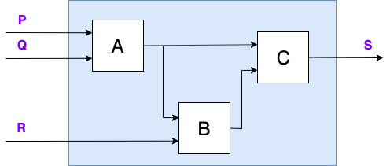
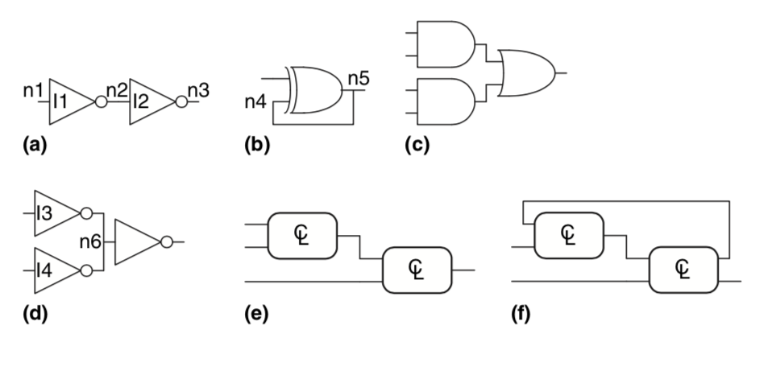
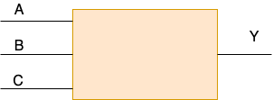

## Digital Processing Element

Một __combinational device__ là một mạch số (digital circuit) gồm các yếu tố sau:

* một hay nhiều đầu vào (digital inputs)
* một hay nhiều đầu ra (digital outputs)
* một bản mô tả chức năng (functional specification): cho biết giá trị đầu ra ứng với mọi tổ hợp đầu vào hợp lệ.
* một bản mô tả thời gian (timing specification): cho biết thời gian tối đa (upper bound - tPD) để thiết bị tính toán đầu ra từ một tập đầu vào hợp lệ bất kỳ.

Đầu vào và đầu ra là tín hiệu số, nghĩa là chúng ta quy sử dụng quy ước tín hiệu như sau: coi điện ở đầu vào hay đầu ra (input or output voltage) < VL (mức điện áp thấp) là tín hiệu số 0, > VH (mức điện áp cao) là tín hiệu số 1.

Một __Combinational Digital System__ (mạch tổng hợp) là một tập liên kết các __combinational device__ thoả mãn:

* Mỗi mạch thành phần đều là **combinational**
* Từng input của từng thành phần đều kết nối tới đúng một input của hệ thống hay một output của thành phần khác hay một mức điện áp hằng số biểu diễn cho giá trị số 0 hay 1.
* Không có mạch vòng (directed cycle): mọi đường dẫn từ input tới output của hệ thống đi qua các thành phần duy nhất một lần.

Giả sử A, B, C đầu là mạch tổng hợp, hệ thống như hình vẽ trên có phải là mạch tổng hợp không? Nếu có thì mô tả chức năng và mô tả thời gian của hệ thống là như thế nào?

* Có đầu vào số?
* Có đầu ra số?
* Có thể suy ra bản (hàm) mô tả chức năng?
* Có thể tính được tPD?

Chúng ta cùng xem xét các ví dụ sau, mạch nào là combinational.

a là mạch tổng hợp, b có mạch vòng nên không phải, c và e là mạch tổng hợp, d không phải do input n6 lại nối với 2 output của I3 và I4, f không phải do có mạch vòng.

## Biểu diễn hàm chức năng

Có nhiều cách để mô tả hàm chức năng (combinational function) của một mạch tổng hợp (combinational device). Ngôn ngữ tự nhiên là một cách mô tả. Ví dụ một combinational device với 3 đầu vào A, B, C và một đầu ra Y có mô tả hàm như sau:

>Nếu C = 1 thì copy giá trị của A vào Y, ngược lại thì copy giá trị của B vào Y.

Cách mô tả bằng lời này có thể gây khó hiểu và nhầm lẫn, nó chẳng khác nào kiểu chơi chữ. Có hai cách mô tả hàm chức năng một cách rõ ràng hơn:

* Bảng chân giá trị - truth table: mô tả cụ thể từng trường hợp.
* Biểu thức logic - Boolean expression: một biểu thức đại số với các phép toán AND(nhân), OR(cộng) và NOT(phủ định - có ký tự gạch trên đầu hay strike).

Một chân lý là mọi combinational function đều có thể được biểu diễn bằng __truth table__ hay một __sum-of-products__ các biểu thức logic tương đương.

| C  | A  | B  | Y  |
|----|:---|:---|:---|
| 0  | 0  | 0  | 0  |
| 0  | 0  | 1  | 1  |
| 0  | 1  | 0  | 0  |
| 0  | 1  | 1  | 1  |
| 1  | 0  | 0  | 0  |
| 1  | 0  | 1  | 0  |
| 1  | 1  | 0  | 1  |
| 1  | 1  | 1  | 1  |

Y = ~~C~~.~~A~~.B + ~~C~~.A.B + C.A.~~B~~ + C.A.B

**Cách hình thành biểu thức logic**

* Viết ra bảng chân giá trị
* Biểu thức logic tương đương là tổng các trường hợp trong truth table có output = 1.
* Xây dụng mạch logic từ biểu thức logic (tìm hiểu trong phần sau)