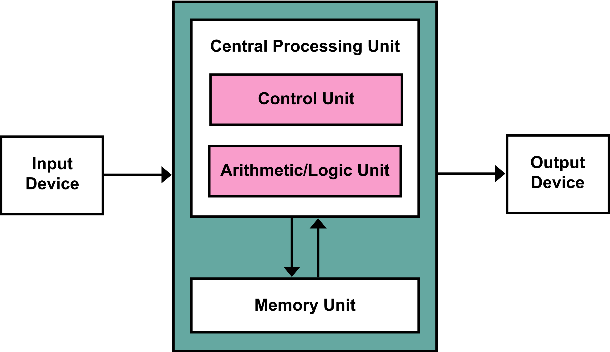

# Giới thiệu

Mã nguồn của chương trình được lưu trong bộ nhớ thế nào?

Dữ liệu của chương trình được lưu trong bộ nhớ ra sao?

Hiểu được cấu trúc của bộ nhớ máy tính và cách lưu trữ mã nguồn cũng như dữ liệu trong bộ nhớ máy tính sẽ giúp chúng ta lập trình đúng đắn và hiệu quả hơn. 

# Von Neumann Architecture

Hiện tại hầu hết các máy tính đầu có kiến trúc Von Neumann với các thành phần chính là:
* CPU: Center Processing Unit, bộ xử lý trung tâm bao gồm CU - Control Unit, ALU - Arthmetic/Logic Unit, và tập các thanh ghi registers. ALU thực hiện các phép toán số học và logic, lấy đầu vào từ các thanh ghi và lưu kết quả ở các thanh ghi khác. CU thực hiện điều khiển giải mã lệnh và điều khiển các tín hiệu để phối hợp các thành phần của máy tính thực hiện mã lệnh.
* Memory Unit: Bộ nhớ chính của máy tính, là nơi lưu trữ mã nguồn (dạng binary) và dữ liệu của chương trình.
* Input/Output Device: Các thiết bị ngoại vi của máy tính. Các thiết bị ngoại vi được chia làm hai nhóm: input và output. Input device cung cấp đầu vào cho máy tính như keyboard, mouse, hay sensor. Output device là kết quả đầu ra của máy tính như màn hình. Một số thiết bị vừa là input vừa là output device như card mạng, card audio, hay màn hình cảm ứng.

# Memory Map

Thông thường bộ nhớ máy tính sẽ được chia thành các phần như hình vẽ sau 

**The Text Segment**

Là nơi lưu trữ mã nguồn binary của chương trình. Như kiến trúc MIPS-32, vùng này có kích thước 256 MB. 

**The Global Data Segment**

Còn gọi là phân vùng dữ liệu toàn cục. Vùng này được sử dụng để lưu các biến toàn cục, trái với các biến nội bộ, và có thể được truy cập bởi tất cả các hàm trong một chương trình.

Trong C, tất cả các biến khai báo ngoài tất cả các hàm kể cả hàm *main* sẽ là biến toàn cục và có thể được truy cập từ biến kỳ hàm nào. 

Vùng này có kích thước 64 KB (MISP-32).Để truy cập vùng này CPU sử dụng một thanh ghi có tên là global pointer ($sp).

**The Dynamic Data Segment**

Vùng dữ liệu động dùng làm *stack* và *heap*. Vùng này có kích thước lớn nhất, chiếm tới 2 GB.

Stack được dùng để lưu trữ và phục hồi các thanh ghi được sử dụng trong các hàm và lưu các giá trị cục bộ cố định như mảng. Stack phát triển theo hướng đi xuống từ trên đỉnh của dynamic data segment và được truy cập theo kiểu LIFO - last-in-first-out.

Heap dùng để lưu trữ các dữ liệu được sinh ra trong quá trình chạy chương trình (runtime). Trong C, bộ nhớ được cấp phát bởi hàm *malloc* và trong Java hay C++, bộ nhớ được cấp phát bởi keyword *new*. Heap được cấp phát và giải phóng không theo thự tự. Heap phát triển theo hướng đi lên từ đáy của dynamic data segment. 

Stack được quản lý tự động bởi *compiler*. Compiler biết chính xác cần lấy bao nhiêu bộ nhớ trong stack và khi nào thì giải phóng (được thực hiện thông qua tăng giảm gía trị của thanh ghi *stack pointer*). Trong khi lập trình viên cần tự quản lý dữ liệu trong Heap. Trong C, khi không dùng bộ nhớ trong Heap nữa thì dùng hàm *delete* để giải phóng. Các ngôn ngữ khác thì lại dùng một tiến trình dọn rác để giải phóng bộ nhớ Heap.

Nếu Stack và Heap phát triển chèn lên nhau thì dữ liệu của chương trình sẽ bị sai lệnh. Do đó khai cấp phát bộ nhớ, thư viện cấp phát sẽ không để trường hợp này xảy ra và thường trả về lỗi *out of memory*. Còn lỗi *stack overflow* là gì? (Dành bạn đọc trả lời)

**The Reversed Segment**

Vùng bộ nhớ này được dành cho *interupt handler* và *memory-mapped IO** dùng để xử lý IO device và các interupt trong CPU. Ngoài ra vùng này còn được dùng bởi hệ điều hành và không thể được truy cập trực tiếp từ chương trình của chúng ta.

# Memory Hierarchy

Theo lẽ thường, chúng ta muốn có một bộ nhớ máy tính vừa có dung lượng lớn, tốc độ truy cập nhanh và rẻ tiền. Nhưng thông thường bộ nhớ máy tính chỉ đạt được hai trong ba tiêu chí. Do đó để sử dụng bộ nhớ hiệu quả và chi phí chấp nhận được thì ngày nay các hệ thống máy tính đều có một hệ thống bộ nhớ phân cấp.

Bộ nhớ với công nghệ khác nhau sẽ có tấc độ truy cập và giá thành khác nhau.

Bộ nhớ chính được làm từ công nghệ DRAM (Dynamic RAM), xây dựng từ capacitor - tụ điện. DRAM có tấc độ truy cập kém xa tấc độ xử lý của CPU, ngoài ra DRAM cần liên tục refresh làm mới (do điện tích của tụ điện mất dần) nên năng lượng tiêu thụ sẽ thêm phần tốn kém. Để giải quyết vấn đề này thì bộ nhớ đệm - cache được đưa vào trung gian giữa CPU và bộ nhớ chính. 

Bộ nhớ đệm có kích thước vài KB đến vài MB tuỳ họ vi xử lý. Công nghệ sử dụng để làm ra bộ nhớ cache là SRAM (Static RAM) - mạch điện được tạo bởi transistor. Tấc độ truy cập của bộ nhớ đệm nhanh gấp hàng chục, hàng trăm lần bộ nhớ chính. Thông thường, bộ nhớ đệm được nhà sản xuất xây dựng on chip - nghĩa là được gán vào trong CPU.

Tầng thứ ba của hệ thống bộ nhớ là virtual memory. Khi dữ liệu không quá lớn và không thể lưu trong bộ nhớ chính, thì chúng được lưu trong virtual memory. Virtual memory thường là ổ đĩa HDD (Hard Disk Drive) hay SSD (Solid State Drive)
