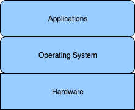
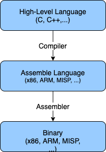
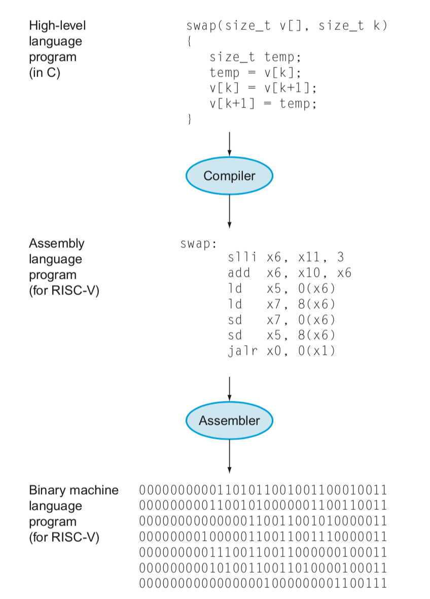
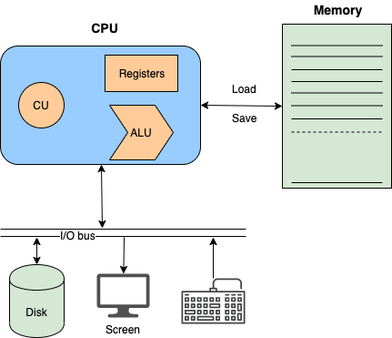

## Computer System

Một hệ thống máy tính sẽ bao gồm phần cứng (hardware) và các phần mềm hệ thống (system software) hoạt động cùng nhau để có thể chạy các ứng dụng của chúng ta (applications).

**Ứng dụng**: Từ phần mềm soạn thảo văn bản, trình duyệt web, đến ứng dụng chơi game. Tất cả các phần mềm mà người dùng có thể sử dụng trực tiếp trên hệ thống máy tính.

**Phần mềm hệ thống**: Hệ điều hành (OS - Operating System) sẽ là cầu nối trung gian giữa các ứng dụng và hệ thống phần cứng của máy tính. Nhiệm vụ OS là cung cấp dịch vụ và quản lý tài nguyên phần cứng được sử dụng bởi các phần mềm ứng dụng. Ngoài hệ điều hành thì còn có một số phần mềm hệ thống nữa như: compiler, linker, loader. Chúng tra sẽ tìm hiểu ở phần sau.

**Hệ thống phần cứng**: Trực tiếp sử dụng điện năng để thực hiện các tác vụ từ phần mềm yêu cầu. Một chiếc máy tính sẽ bao gồm các thành phần cơ bản như: CPU (bộ xử lý trung tâm), Memory (bộ nhớ chính), và các thiết bị ngoại vi I/O devices.

Loạt bài viết về kiến trúc máy tính sẽ tập trung vào tầng phần cứng và đôi chút về phần mềm hệ thống để giúp bạn hiểu được máy tính hoạt động ra sao.

## Trừu tượng hoá (Abstraction)

Máy tính có ngôn ngữ riêng của nó, một thứ ngôn ngữ chỉ có hai ký tự 0 và 1 (nhị phân), gọi là mã máy - machine code (cụ thể ngôn ngữ của máy tính là gì sẽ được trình bày trong bài viết tiếp theo). Thật là khó khăn nếu chúng ta phải lập trình với mã nhị phân để điều khiển máy tính theo ý mình, chính vì vậy các mức trừu tượng được xây dựng để các nhà phát triển có thể dễ dàng xây dựng các chương trình máy tính bằng thứ ngôn ngữ bậc cao gần với ngôn ngữ giao tiếp hằng ngày hơn.

**High-level language**: C, C++, Java, Python,... Các ngôn ngữ bậc cao cung cấp các khái niệm gần gũi với tư duy của lập trình viên như biến, hàm, rẽ nhánh, vòng lặp,... giúp cho việc lập trình trở nên đơn giản hơn. Ngữ pháp và từ khoá của ngôn ngữ bậc cao đều là ngôn ngữ thân thuộc với mọi người (tiếng Anh), nên việc mô tả tính toán sẽ dễ dàng hơn là mô tả tính toán bằng mã máy.

**Assemble language**: Hợp ngữ là ngôn ngữ trung gian giữa ngôn ngữ bậc cao và mã máy. Compiler (trình biên dịch) sẽ biên dịch mã code từ ngôn ngữ bậc cao sang hợp ngữ. Hợp ngữ gần hơn với mã máy và mỗi một kiến trúc riêng sẽ có một hợp ngữ riêng.

**Machine code**: một chương trình gọi là assembler sẽ dịch hợp ngữ sang mã máy (nhị phân) mà máy tính có thể hiểu và chạy được.

Mô hình phần cứng của các máy tính là giống nhau, tuy nhiên mỗi hãng sản xuất lại thiết kế một bộ mã nhị phân riêng để điều khiển máy tính (gọi là kiến trúc tập lệnh - instruction set architecture - ISA). Có nhiều kiến trúc khác nhau như Intel x86, ARM, MIPS, RISC-V. Chúng ta sẽ tìm hiểu ISA trong bài viết khác.

Ví dụ một đoạn mã code C được dịch sang mã máy

## Computer Organization

Một chiệc máy tính hiện đại sẽ có 4 thành phần cơ bản:

* CPU - Center Processor Unit
* Memory - bộ nhớ chính
* Input Device
* Output Device

**CPU** đóng vai trò là trung tâm điều khiển và tính toán. Nó phối hợp các thành phần khác lại với nhau để chạy chương trình máy tính. CPU gồm có các phần cơ bản là **Control Unit (CU)**, **Registers (thanh ghi)** và **Arithmetic Logic Unit (ALU)** - khối xử lý số học và logic. CU thực hiện nhiệm vụ điều khiển, ALU thực hiện tính toán, còn các thanh ghi đóng vai trò hỗ trợ.

**Memory**: bộ nhớ chính là nơi lưu trữ mã lệnh và dữ liệu của chương trình máy tính. Bộ nhớ chính còn được gọi là RAM chip - Random Access Memory được thiết kế là một mảng các ô nhớ (gọi là word) có kích thước giống nhau và cho phép truy cập trực tiếp tới bất kỳ ô nhớ nào với thời gian như nhau. Memory có tính chất tạm thời, khi ngắt điện thì mọi dữ liệu sẽ bị mất.

**Input**: Các thiết bị đầu vào như keyboard, mouse cung cấp đầu vào cho máy tính.

**Output**: Các thiết bị đầu ra như màn hình, card audio là đầu ra của máy tính. Một số thiết bị vào là input vừa là output như touch screen, netword card, hay ổ cứng.

Input hay output được gọi chung là I/O devices hay thiết bị ngoại vi. Các thiết bị ngoại vi điển hình của máy tính là keyboard, màn hình và ổ cứng (disk). Ổ cứng dùng để lưu trữ chương trình, dữ liệu và không bị mất đi khi ngắt điện.

Ban đầu chương trình được lưu ở ổ cứng và sau đó nó được load lên bộ nhớ chính. CPU sẽ đọc từng lệnh trong memory và thực hiện tính toán cũng như lưu trữ dữ liệu. Trong quá trình đó CPU có thể lấy thông tin từ Input devices hay xuất thông tin ra Output devices.
