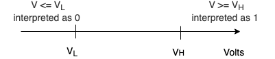
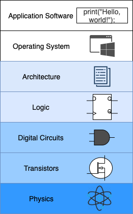

## Binary

Một hệ thống máy tính có thể được định nghĩa là một hệ xử lý thông tin. Hệ thống tiếp nhận thông tin đầu vào, xử lý, tính toán, và đưa ra thông tin đầu ra. Mọi thông tin trong máy tính hiện đại được mã hoá dưới dạng nhị phân (0 hoặc 1, true hoặc false, hay on hoặc off). Để tiện lợi, ta quy ước mọi đầu vào và đầu ra của máy tính được biểu diễn bằng 2 con số 0 hoặc 1.

Nhưng vì sao lại chọn hệ nhị phân để biểu diễn thông tin xử lý trong máy tính thì chúng ta cần đi ngược lại dòng lịch sử để xem quá trình hình thành nên máy tính hiện đại ngày nay. Bạn đọc có thể tham khảo:

* https://en.wikipedia.org/wiki/Timeline_of_computing
* https://en.wikipedia.org/wiki/History_of_computing_hardware

Những thiết kế máy tính ban đầu không sử dụng hệ nhị phân, có loại sử dụng tín hiệu analog (tín hiệu liên tục như tốc độ, lực cơ học, dòng điện), sau đó chuyển sang tín hiệu digital (tín hiệu có giá trị rời rạc), và hình thành nên digital computer. Mô hình digital computer đầu tiên lại sử dụng hệ thập phân, có lẽ do hệ thập phân đã quá quen thuộc với con người, sau đó mới chuyển sang hệ nhị phân. Mỗi tín hiệu sẽ có giá trị 0 hoặc 1, gọi là bit. Chúng ta có thể hình dung máy tính như một thiết bị mà bên trong nó là hàng triệu, hàng tỷ các bits.

Bạn có thể cảm nhận hệ nhị phân thông qua các ví dụ trong đời sống như: ngày và đêm, sáng và tối, bật và tắt, có và không,... 

## Digital Abstraction

Máy tính hiện tại được cấu tạo bởi hàng vô vàn các mạch điện gọi là circuit. Mỗi circuit sẽ nhận một hoặc nhiều đầu vào và cho ra một hay nhiều đầu ra. Điện chạy trong các circuit được dùng để mã hoá thông tin, cụ thể là sử dụng voltage. Mức voltage thấp mã hoá bit 0, còn mức voltage cao mã hoá bit 1.

Việc tạo ra chương trình máy tính bằng các tín hiệu điện là một công việc vô cùng phức tạp. Vì vậy để quản lý sự phức tạp này, chúng ta cần một kỹ thuật gọi là trừu tượng hoá (abstration) - che dấu cơ chế vận hành phức tập bên trong và cung cấp cách thức sử dụng đơn giản ra bên ngoài. Bạn có thể hình dung các tầng abstraction trong mô hình máy tính như hình dưới đây.

Tầng thấp nhất là tầng **vật lý**: sự dịch chuyển của các hạt electrons tuân theo các nguyên lý điện từ (Maxwell equations). Các thành phần của máy tính được cấu tạo bởi vô vàn các phần tử điện gọi là **transistor** - một thiết bị sử dụng công nghệ bán dẫn dùng để điều khiển dòng điện trong mạch điện. Silicon là chất bán dẫn điển hình được sử dụng trong sản xuất transistor - cái tên thung lũng silicon cũng bắt nguồn từ đây. 

Công nghệ transistor hiện đại nhất đang được sử dụng là MOSFET - Metal Oxide Semiconductor Field Effect Transistor. Có 2 loại MOSFET là nMOS và pMOS, chúng được nối với nhau tạo thành CMOS là phần tử xây dựng lên **logic gates** từ đó xây dựng lên các mạch số **digital circuits** là mức abstraction tiếp theo. Để nắm thêm thông tin vào CMOS, bạn có thể tham khảo:

* https://www.elprocus.com/cmos-working-principle-and-applications
* https://en.wikipedia.org/wiki/CMOS

Từ các mạch số, chúng ta xây dựng nên các thiết bị xử lý **logic** như adder, memories (mạch nhớ, chíp nhớ), rồi từ đó xây dựng nên các thành phần trong máy tính như processor, register, RAM, hay I/O devices.

Kiến trúc tập lệnh - **Architecture** mô tả các lệnh mà máy tính có thể thực hiện. Dựa vào kiến trúc này, các nhà lập trình sẽ viết ra chương trình của mình gọi là các chương trình phần mềm. Chương trình phần mềm chia ra làm 2 loại: phần mềm hệ thống như hệ điều hành (Operating System) trực tiếp làm việc với kiến trúc tập lệnh và phần mềm ứng dụng (Application Software) sẽ sử dụng các dịch vụ do phần mềm hệ thống cung cấp.
