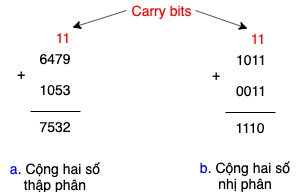

## Decimal number

Chúng ta đã quá quen với số thập phân (decimal) được hình thành từ 10 chữ số 0, 1, 2, 3, 4, 5, 6, 7, 8, 9 (có thể do con người có 10 ngón tay để đếm). Dùng N chữ số thì có thể biểu diễn được 10^N số có giá trị từ 0, 1, ..., 10^N - 1. Cách biểu diễn số thập phân như sau:

```
XnXn-1...X1 = Xn * 10^(n-1) + Xn-1 * 10^(n-2) + ... + X1 * 10^0
```

Chữ số tận cùng bên phải là chữ số có ít giá trị nhất (least significant digit - LSD), càng về bên trái thì giá trị càng tăng, chữ số tận cùng bên trái gọi là chữ số có giá trị nhất (most significant digit - MSD)

## Binary number

Con người sử dụng số thập phân (base 10), còn máy tính lại sử dụng số nhị phân (base 2). Số nhị phân được biểu diễn bởi 2 chữ số 0 và 1. Công thức sau sẽ quy đổi số nhị phân sang số thập phân.

```
XnXn-1...X1 = Xn * 2^(n-1) + Xn-1 * 2^(n-2) + ... + X1 * 2^0
```

```
10010 (base 2) = 1 * 2^4 + 0 * 2^3 + 0 * 2^2 + 1 * 2^1 + 0 * 2^0
               = 16 + 2 = 18 (base 10)
```

Dùng N chữ số thì có thể biểu diễn được 2^N số nhị phân có giá trị từ 0, 1, ..., 2^N - 1

**Decimal to binary**

Cách chuyển đổi từ số thập phân sang số nhị phân như sau:

Khởi tạo: stack = [], số cần chuyển đổi là n

Chia n cho 2 được m và dư k, push k vào stack. Nếu m = 0 thì pop hết các chữ số trong stack và xếp từ trái qua phải ta thu được kết quả. Ngược lại thì gán n = m và thực hiện lặp lại. 

Ví dụ chuyển đổi 83 (base 10) sang số nhị phân sẽ qua các bước như sau:

- n = 83, m = 41, k = 1, stack = [1]
- n = 41, m = 20, k = 1, stack = [1, 1]
- n = 20, m = 10, k = 0, stack = [0, 1, 1]
- n = 10, m = 5, k = 0, stack = [0, 0, 1, 1]
- n = 5, m = 2, k = 1, stack = [1, 0, 0, 1, 1]
- n = 2, m = 1, k = 0, stack = [0, 1, 0, 0, 1, 1]
- n = 1, m = 0, k = 1, stack = [1, 0, 1, 0, 0, 1, 1], m = 0 -> kết quả là 1010011

83(base 10) -> 1010011(base 2)

## Hexadecimal number

Biểu diễn số nhị phân có thể là một chuỗi dài, để giảm độ dài và khả năng mắc lỗi, chúng ta thường gom các chữ số nhị phân - bit (binary digit) thành nhóm 4 bits. Mỗi nhóm 4 bits sẽ biểu diễn được 16 giá trị, do đó sinh ra hệ cơ số hexa (16). 16 ký tự được sử dụng để biểu diễn 16 giá trị là 0, 1, 2, ...,9, A, B, C, D, E, F lần lượt ứng với nhóm 4 bits là 0000, 0001, ..., 1111. Khi biểu diễn số hexa, chúng ta thường thêm tiền tố 0x, ví dụ: 0x6E. Giá trị của số hexa được cho bởi công thức sau:

```
0xXnXn-1..X1 = Xn * 16^(n-1) + Xn-1 * 16^(n-2) + ... + X1 * 16^0
```

Trong đó các chữ số A, B, C, D, E, F có giá trị là 10, 11, 12, 13, 14, và 15 trong hệ thập phân

0x6E5D = 6 * 16^3 + 14 * 16^2 + 5 * 16^1 + 13
       = 28253 (base 10)

**Decimal to hexa**

Cách chuyển từ số thập phân sang số hexa tương tự như từ số thập phân sang nhị phân, nhưng thay vì chia cho 2 thì ta chia cho 16.

Ví dụ chuyển 2869 sang hệ hexa

- n = 2837, m = 154, k = 5, stack = [5]
- n = 154, m = 9, k = 10, stack = [A, 5]
- n = 9, m = 0, k = 9, stack = [9, A, 5], m = 0 -> kết quả là 9A5

2869(base 10) -> 0x9A5(hexa)

**Binary to Hexa**

Để chuyển từ số nhị phân sang số hexa thì chúng ta nhóm các chữ số nhị phân thành các nhóm 4 bits. Thực hiện nhóm từ bên phải qua bên trái. Sau đó đổi các nhóm này thành chữ số hexa.

Ví dụ 10100111101 sang hexa

10100111101 -> 101 0011 1101 -> 5 3 D -> 0x53D

Việc chuyển từ hexa sang binary thì chỉ cần biểu diễn từng chữ số trong số hex dưới dạng nhóm 4 bits là được số nhị phân.

0x2E3F -> 0010 1110 0011 1111 -> 0010111000111111

## Cộng số nhị phân

Khi cộng hai số thập phân, chúng ta gióng 2 số từng phải qua trái, rồi thực hiện cộng các chữ số trên cùng cột cũng theo thứ tự từ phải qua trái (hàng đơn vị cộng hàng đơn vị, hàng chục cộng hàng chục, ...). Trong khi thực hiện như vậy, nếu tổng của hai chữ số vượt quá 1 chữ số thì giữ lại chữ số đầu và ghi nhớ chữ số thứ 2 cho cột tiếp theo. Việc cộng hai số nhị phân cũng được thực hiện tương tự, khi 1 + 1 = 10, chúng ta giữ lại bit 0 và ghi nhớ bit 1 cho cột tiếp theo. Bit được ghi nhớ gọi là bit nhớ hay carry bit.



Các hệ thống số (digital systems) thường hoạt động với hệ cố định số lượng các chữ số. Ví dụ một hệ cố định với 8 bits, nghĩa là nó hoạt động với các con số sinh ra từ 8 bits. Việc cộng gọi là *overflow* nếu kết quả vượt quá số chữ số cho phép. Một hệ 8 bits có khoảng giá trị là [0, 255]. Nếu cộng các số 8 bits có kết quả vượt quá 255 thì được gọi là *overflow*, bit thứ 9 bị bỏ qua và sinh ra kết quả không đúng.


## Biểu diễn số có dấu

Biểu diễn số có dấu (âm và dương) bằng mã nhị phân? Chúng ta có một số cách như sau.

**Sign/Magnitude Numbers**

Sử dụng bit giá trị nhất (the most significant bit, left most bit) làm bit đánh dấu gọi là sign bit, các bit còn lại tính làm giá trị. Sign bit 0 đánh dấu đây là số dương, còn bit 1 đánh dấu đây là số âm. Với cách biểu diễn này thì N bits sẽ biểu diễn được khoảng giá trị [-(2^(N-1) - 1), 0] và [0, 2^(N-1)].

Ví dụ 5 và -5 được biểu diễn bằng số 4 bits như sau: 0101 và 1101 cùng tồn tại, như vậy cùng một số lại có 2 biểu diễn. Và phép cộng cũng không thực hiện được.

**Two's Complement Number (số bù)**


