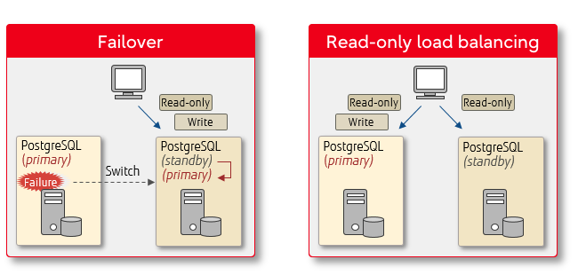

## Database replication

In the context of database, `replication` means creating a copy of a database.

In PostgreSQL, there are 2 types of replication: 

* Streaming replication (physical replication) that replicates a database cluster.
* And logical replication that replicates in units of tables and databases.

## Streaming replication

Allows the updated information on the primary server to be transferred to the standby server in real time. We can get great benefits to our system:

* **Failover**: When the primary server fails, the standby server can take over the operation.
* **Read-only load balancing**: Read-only SQL processing can be distributed among multiple servers.

By using the load balancing feature ò pgpool-ii, an open source extension, read-only queries can be efficiently distributed between the PostgreSQL instances, and workload can be balanced.

## Streaming replication mechanism

PostgreSQL saves the updated information of the primary server as a transaction log known as `write-ahead log` or `WAL`, in preparation for crash recovery or rollback. Streaming replication works by transferring the WAL to the standy server in real time, and applying it on the standy server.

## References

* https://www.postgresql.fastware.com/postgresql-insider-ha-str-rep
* https://github.com/bitnami/containers/tree/main/bitnami/pgpool#how-to-use-this-image
* https://www.pgpool.net/docs/pgpool-II-4.2.3/en/html/example-kubernetes.html
* https://fatdragon.me/blog/2016/05/postgresql-ha-pgpool-ii-part-3