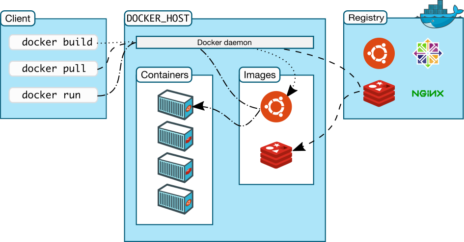

## Overview

Docker là một open platform dùng cho việc phát triển, chuyển giao và run application.

Docker cung cấp khả năng đóng gói và chạy app trong một môi trường isolated gọi là **container**. Do đó chúng ta có thể chạy nhiều containers
đồng thời trên một máy mà không lo ngại chúng sẽ xung đột với nhau hay với chính host machine.

## Docker Architecture



**Docker daemon** (dockerd): là một process chạy ngầm. dockerd quản lý *docker objects*: images, containers, networks và volumes.
Một dockerd có thể giao tiếp với dockerd khác (trên host khác) để quản lý docker *services*.
Dockerd cung cấp API để **docker client** có thể tương tác (e.g. quản lý objects) với nó.

Docker objects:

* **Images**: một image là template chứa các instructions (lệnh) dùng để tạo Docker containers. Thông thường, một image sẽ được based từ một
image khác và thêm vào đó phần customization. Ví dụ build một image based từ image *ubuntu* nhưng có cài thêm Apache server và application.
* **Containers**: một container là một runnable instance của image. Container là *isolated* với container khác và với host machine. Bạn có thể
kiểm soát tính *isolated* của container network và storage với container khác và với host machine. 

Khi một container bị removed thì mọi thay đổi và trạng thái (state, e.g. file, data, ...) không được lưu lại vào persistent storage, sẽ biến mất.

**Docker client** hay *docker* là một command line interface (CLI) dùng để tương tác với *dockerd* thông qua các command (sử dụng API)
ví dụ như *docker run* (tạo container). Docker client có thể tương tác với nhiều *dockerd* (cấu hình DOCKER_HOST).

**Docker registries** là nơi lưu trữ *docker images*. [Docker hub](https://hub.docker.com/) là một public registries, ai cũng dùng được.
Bạn cũng có thể tạo private registry của mình. Docker được cấu hình tìm kiếm docker images từ Docker Hub. Bạn có thể pull image từ registry
về máy local hay push image của mình lên registry.


## Get started

Để bắt đầu với Docker, thực hiện theo bài hướng dẫn ở link dưới đây:

https://docs.docker.com/get-started

## Build docker images

Docker builds images bằng cách đọc các lệnh từ **Dockerfile** - một file text chứa tất cả các lệnh để build image.

Format của Dockerfile:


```sh
# Comment
INSTRUCTION arguments
```


Các lệnh không phân biệt hoa thường. Nhưng convention thì nên viết lệnh UPPERCASE để phân biệt với tham số.

Một Dockerfile **phải bắt đầu** bằng một lệnh **FROM** để chỉ định *Base image* và từ đó dùng cho các lệnh tiếp theo.

**FROM**

`FROM [--platform=<platform>] <image> [AS <name>]`

* `FROM` có thể xuất hiện nhiều lần trong Dockerfile trong trường hợp sử dụng *build stage*
* `AS name` gán tên cho build stage và có thể được dùng cho lệnh `FROM` sau đó, ví dụ `COPY --from<name>`
* `--platform` chỉ định platform của image, ví dụ: linux/amd64, linux/arm64, hay windows/amd64. Mặc định là platform của máy.


**RUN**

Lệnh RUN dùng để chạy bất kỳ commands nào trong một layer mới của image hiện tại và commit kết quả.

Lệnh RUN có 2 forms:

* `RUN <command>` (*shell* form, the command được chạy trong một shell, mặc định trong Linux là `/bin/sh -c` và `cmd /S /C` trong Windows)
* `RUN ["executable", "param1", "param2", ..]` (*exec* form)


**CMD**

`CMD` có 3 forms:

* `CMD ["executable", 'param1", "param2", ..]` (*exec* form)
* `CMD ["param1", "param2", ..]`(như là *default parameters* cho `ENTRYPOINT`)
* `CMD command param1 param2 ..` (*shell* form)

Có duy nhất một lệnh `CMD` trong một Dockerfile. Nếu có nhiều thì chỉ lệnh `CMD` cuối cùng có tác dụng.

**Mục đích chính** của `CMD` là **cung cấp chương trình mặc định khi chạy container**. Nếu không có thì bạn phải chỉ định
`ENTRYPOINT` instruction.

Nếu `CMD` được sử dụng để cung cấp default cho `ENTRYPOINT`, thì cả hai lệnh cần được khai báo dưới dạng ARRAY (`["abc", "xyz",..]`)

Khác với *shell* form, thì *exec* form sẽ không gọi command shell, đồng nghĩa với xử lý shell thông thường không xảy ra. Ví dụ
`CMD ["echo", "$HOME"]` sẽ không thực hiện thay thế biến môi trường `$HOME`. Nếu muốn xử lý shell thì hoặc sử dụng *shell* form hay 
chạy shell trực tiếp, ví dụ như `CMD [ "sh", "-c", "echo $HOME"]`.

Khi sử dụng *exec* form và chạy trực tiếp shell thì shell sẽ sử lý thay thế biến môi trường, chứ không phải docker.

Khi được sử dụng ở dạng *shell* hay *exec*, `CMD` được command được chạy khi running image (chạy container).

Nếu sử dụng *shell* form của `CMD`, thì `<command>` sẽ được chạy với `/bin/sh -c`:

```sh
FROM ubuntu
CMD echo "this is the shell form cmd." | wc -
```

Nếu muốn chạy `<command>` without shell, bạn phải sử dụng array form và chỉ định path tới executable.

```sh
FROM ubuntu
CMD ["/ur/bin/wc", "--help"]
```

Nếu muốn container chạy same executable every time, bạn cần sử dụng lệnh `ENTRYPOINT` (có thể combination với `CMD`).

Nếu bạn chỉ định command khi run container từ command `docker run <IMAGE> [COMMAND]` thì command này sẽ overwrite default
được chỉ định trong `CMD`.

Không nhầm lẫn `RUN` với `CMD`. `RUN` thực sự chạy command và commit kết quả; `CMD` không chạy gì cả tại thời điểm build.


**EXPOSE**

`EXPOSE <port> [<port>/<protocol>...]`

`EXPOSE` instruction báo rằng container sẽ listen nhưng ports nào lúc chạy. Bạn có thể chỉ định protocol là TCP hay UDP, 
mặc định là TCP. `EXPOSE` thực tế không publish port, muốn publish port, sử dụng `-p` khi chạy container `docker run`.

```sh
EXPOSE 80/tcp
EXPOSE 80/udp
```

Publish port lúc chạy container:

`$ docker run -p 80:80/tcp -p 80:80/udp`


**ENV**

`ENV <key>=<value> ...`

`ENV` instruction set biến môi trường, giá trị của các biến này sẽ ở môi trường của các instruction phía sau.
Các biến này được persist khi container chạy. Bạn có thể xem giá trị của chúng bằng `docker inspect`, 
và thay đổi giá trị `docker run --env <key>=<value>` (-e is short hand).

Nếu một biến môi trường chỉ được sử dụng khi build mà không phải cho the final image, hãy cân nhắc set giá trị
trong command:

`RUN DEBIAN_FRONTEND=noninteractive apt-get update && apt-get install -y ...` 

Hay là sử dụng `ARG`, sẽ không peristent trong image cuối cùng.

```sh
ARG DEBIAN_FRONTEND=noninteractive
RUN apt-get update && apt-get install -y ...
```


**ADD**

ADD có 2 forms:

```sh
ADD [--chown=<user>:<group>] [--checksum=<checksum>] <src>... <dest>
ADD [--chown=<user>:<group>] ["<src>",... "<dest>"] 
```

Form thứ hai cần khi path có chứa white spaces.

`ADD` instruction thực hiện copy files, directories hay remote file URLs từ `<src>` và thêm chúng vào filesystem của image
tại path `<dest>`.

Nhiều `<src` có thể được chỉ định. Nếu là files hay directories thì path của chúng được quy ước là tương đối với thư mục khi build (build context).

`<dest>` là đường dẫn tuyệt đối hay tương đối với `WORKDIR`, chỉ định source được copy vào chỗ nào của container.

Add "test.txt" to `<WORKDIR>/relativeDir`:

`ADD test.txt relativeDir`

Hay sử dụng absolute path

`ADD test.txt /absoluteDir`

Tất cả file và thư mục mới được tạo với a UID và GID 0, trừ khi sử dụng option `--chown`, user and group can be name string or integer id.
Name sẽ được lookup từ `/etc/passwd` và `/etc/group`.

Notes: nếu build bằng cách pass `Dockerfile` through STDIN (`docker build - < somefile`), khi đó không có build context, `Dockerfile` chỉ
có thể chứa URL based của `ADD`. Có thể pass một compressed archive through STDIN (`docker build - < archive.tar.gz`), `Dockerfile` nằm ở
root của archive and phần còn lại của archive sẽ được sử dụng như là context của build.

`ADD` tuân theo các rules sau:

* `<src>` path phải nằm trong `context` của build, bạn không thể `ADD ../something /somthing` bởi vì bước đầu tiên khi build
`docker build` là send context directory (và subdirectories) cho `docker daemon`.
* Nếu `<src>` là a URL và `<dect>` không kết thúc với `/`, thì file download được từ URL sẽ được copy tới `<dect>`.
* Nêu `<src>` là a URL và `<dect>` kết thúc với `/`, thì file download được sẽ lưu tại `<dect>/<filename>`. Ví dụ
`ADD http://example.com./foobar /` sẽ lưu file tại `/foobar`.
* Nếu `<src>` là một directory, toàn bộ contents của directory được copy, bao gồm của filesystem metadata
* Nếu nhiều `<src>` được dùng, sử dụng trực tiếp hay wildcard, thì `<dect>` phải là một directory, và phải kết thúc với `/`.
* Nếu `<dect>` không kết thúc với `/`, nó sẽ được coi là một file thông thường và nội dung của `<src>` sẽ được lưu tại `<dect>`
* Nếu không có `<dect>` thì nó sẽ được tạo cùng với tất cả các thư mục còn thiếu trong path của nó.


**COPY**

`COPY` có 2 forms:

```sh
COPY [--chown=<user>:<group>] <src>... <dest>
COPY [--chown=<user>:<group>] ["<src>",... "<dest>"]
```

Form thứ hai được dùng khi path có chứa whitespace.

Đặc biệt là `COPY` nhận một flag `--from=<name>` được sử dụng để chỉ định source location trỏ tới `build stage` phía trước
(tạo ra bời `FROM.. AS <name>`).

`COPY` hoạt động giống `ADD`, nhưng khác là `COPY` không tự động extraction và không dùng với URL.


**ENTRYPOINT**

The *exec* form (preferred):

`ENTRYPOINT ["executable", "param1", "param2"]`

The *shell* form:

`ENTRYPOINT command param1 param2`

`ENTRYPOINT` dùng để cấu hình executable cho container.

Command line arguments của `docker run <image>` sẽ được appended sau các phần trong *exec* form của `ENTRYPOINT`, và cũng 
override tất cả các phần của `CMD`.

*shell* form hạn chế (prevent) mọi `CMD` và `run` command arguments. `ENTRYPOINT` dạng shell sẽ chạy command như là subcommand
của `/bin/sh -c`, và không pass signals. Điều này có nghĩa là *executable* process không phải là process `PID 1` của containter
và sẽ *không nhận* Unix signals - process này sẽ không nhận `SIGNTERM` từ `docker stop <container>`.

Chỉ có lệnh `ENTRYPOINT` cuối cùng trong `Dockerfile` là có tác dụng. 

Ví dụ *exec* form của `ENTRYPOINT`

```sh
FROM ubuntu
ENTRYPOINT ["top", "-b"]
CMD ["-c"]
```

Khi chạy container, `top` là process duy nhất.

`docker run -it --rm --name test <image>`

Liệt kê process

`docker exec test ps aux`

Process chạy sẽ là `top -b -c`, nếu chạy với arguments

`docker run -it --rm --name test <image> -H`

Process chạy sẽ là `top -b -H`

Mối tương tác của `CMD` và `ENTRYPOINT` được thể hiện ở bảng sau:

|                 | No ENTRYPOINT       | ENTRYPOINT exec_entry p1_entry | ENTRYPOINT ["exec_entry", "p1_entry"] |
|-----------------|---------------------|--------------------------------| --------------------------------------|
| No CMD          | error, not allowed  | /bin/sh -c exec_entry p1_entry | exec_entry p1_entry                   |
|-----------------|---------------------|--------------------------------|---------------------------------------|
| CMD ["exec_cmd" | exec_cmd p1_cmd     | /bin/sh -c exec_entry p1_entry | exec_entry p1_entry                   |
| , "p1_cmd"]     |                     |                                | exec_cmd p1_cmd                       |   
|-----------------|---------------------|--------------------------------|---------------------------------------|
| CMD exec_cmd    | /bin/sh -c exec_cmd | /bin/sh -c exec_entry p1_entry | exec_entry p1_entry                   |
|     p1_cmd      |            p1_cmd   |                                | /bin/sh -c exec_cmd p1_cmd            |
|-----------------|---------------------|--------------------------------|---------------------------------------|


**VOLUME**

`VOLUME ["/data"]`

`VOLUME` instruction tạo một *mount point* dùng để mount dữ liệu tại các thư mục được chỉ định ra bên ngoài. Tham số
là một JSON array, `VOLUME ["/var/log", "/var/db"]` hay `VOLUME /var/log /var/db`. Chúng ta sẽ tìm hiểu chi tiết hơn
về cách *lưu và chia sẻ dữ liệu* của container ở phần sau.


**USER**

`USER <user>[:<group>]`

hoặc là

`USER <uid>[:<gid>]`

Set user và group để chạy các lệnh đằng sau, trong đó có `ENTRYPOINT` và `CMD`


**WORKDIR**

`WORKIDR /path/to/workdir`

Set working directory cho các lệnh theo sau như `RUN`, `CMD`, `ENTRYPOINT`, `ADD`, và `COPY`.

Nếu `/path/to/workdir` không tồn tại thì nó sẽ được tạo ra.

```sh
WORKDIR /a
WORKDIR b
WORKDIR c
RUN pwd
```

Như ví dụ trên thì output của `pwd` sẽ là `/a/b/c`


**ARG**

`ARG name[=<default_value>]`

Khai báo tham số được dùng khi build image `docker build` thông qua `--build-arg name=value`

Lệnh `RUN` có thể sử dụng các biến khai báo bởi `ARG` và `ENV`. Các biến môi trường được định nghĩa bởi `ENV`
sẽ overwrite `ARG`.

```sh
FROM ubuntu
ARG IMG_VER
ENV IMG_VER=v1.0.0
RUN echo $IMG_VER
```

Với ví dụ trên, thực hiện build image

`docker build --build-arg IMG_VERSION=v2.1.0 .`

`RUN` instruction sẽ lấy giá trị `v1.0.0` thay vì `v2.1.0` từ `ARG`.


**Tham khảo**

https://docs.docker.com/develop/develop-images/dockerfile_best-practices/

Các lệnh thường được dùng để viết Dockerfile (https://docs.docker.com/build/building/packaging/)

| Lệnh                | Mô tả                                                                                       |
|---------------------|---------------------------------------------------------------------------------------------|
| `FROM <image>`      | Chỉ định base image                                                                         |
| `RUN <command>`     | Chạy command trong một layer mới trên top của image hiện tại và commit kết quả              |
| `WORKDIR directory` | Đặt working directory cho các lệnh `RUN`, `CMD`, `ENTRYPOINT`, `COPY` và `ADD`              |
| `COPY <src> <dest>` | Copy files và directories từ `<src>` và thêm chúng vào filesystem của container tại `<dect>`|
| `CMD command`       | Cài đặt chương trình mặc định sẽ chạy khi bạn start container                               |


## Viết starter script cho ENTRYPOINT

Trường hợp muốn viết một script để tạo ra file chạy và đảm bảo file chạy này nhận Unix signals, sử dụng `exec` và `gosu` command.

Xét ví dụ chạy Postgres server bằng script.

```sh
#!/bin/bash

# exits for non-zero exit status value
set -e

if [ "$1" = 'postgres' ]; then
   # setup data directories and permissions (when run as root)
    chown -R postgres "$PGDATA"
    
    if [ "$(id -u)" = '0' ]; then
			# then restart script as postgres user
			exec gosu postgres "$BASH_SOURCE" "$@"
		fi

    if [ -z "$(ls -A "$PGDATA")" ]; then
        postgres initdb
    fi
fi

exec "$@"
```

Dockerfile

```yaml
FROM debian:bullseye-slim

# explicitly set user/group IDs
...
# add gosu for easy step-down from root
# https://github.com/tianon/gosu/releases
ENV GOSU_VERSION 1.16
...

COPY docker-entrypoint.sh /usr/local/bin/
ENTRYPOINT ["docker-entrypoint.sh"]
EXPOSE 5432
CMD ["postgres"]
```

[Postgres Dockerfile](https://github.com/docker-library/postgres/blob/ef45b990868d5a0053bd30fdbae36551b46b76c9/15/bullseye/Dockerfile)

# Tài liệu tham khảo

https://docs.docker.com/get-started/overview/

https://docs.docker.com/get-started/

https://docs.docker.com/develop/

https://docs.docker.com/language/
