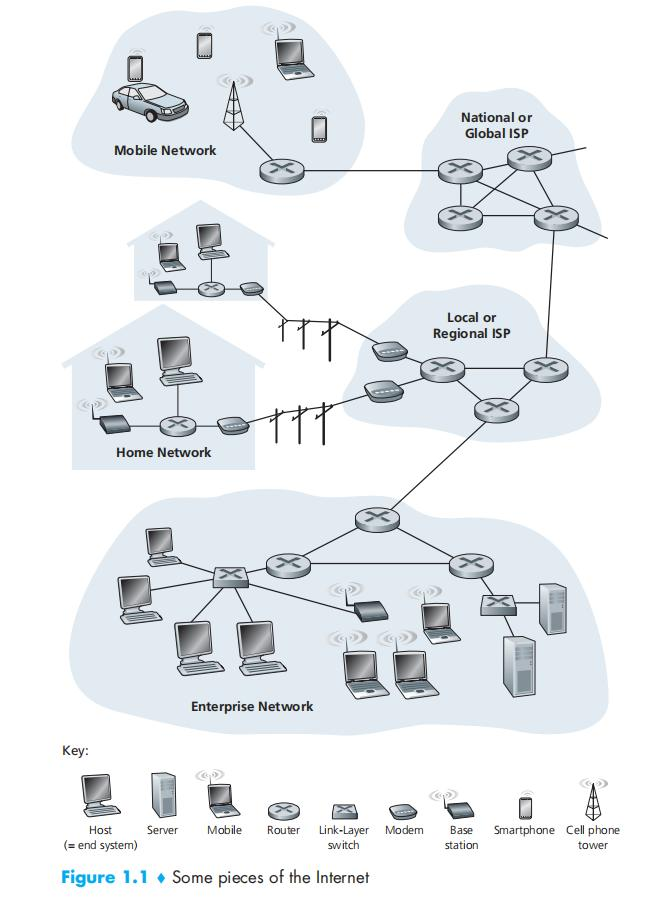
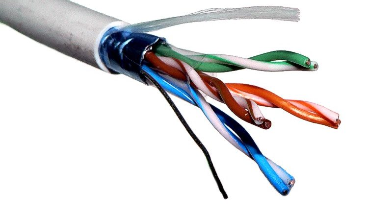
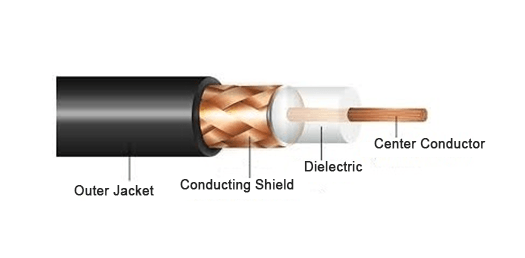
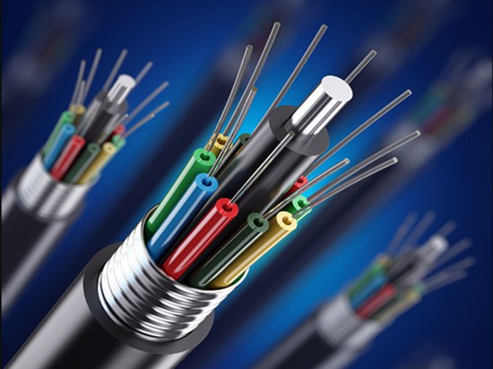
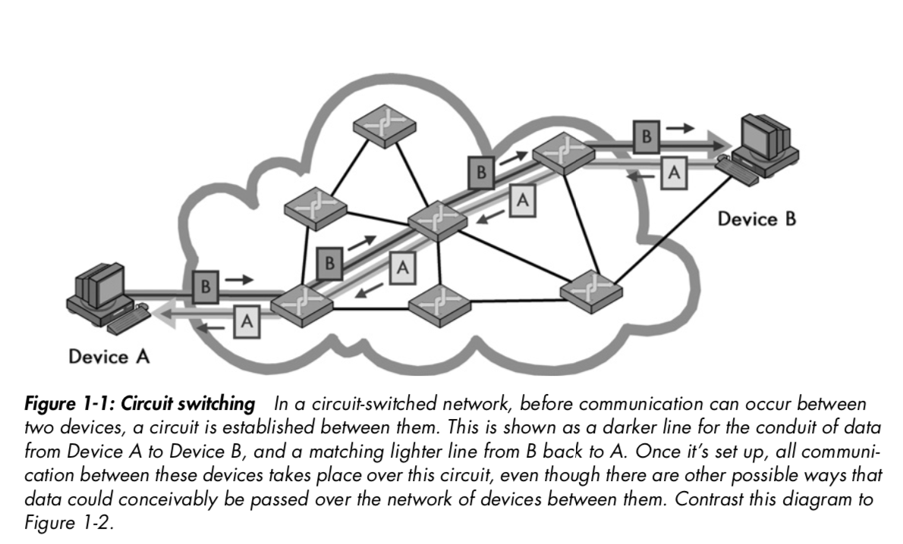
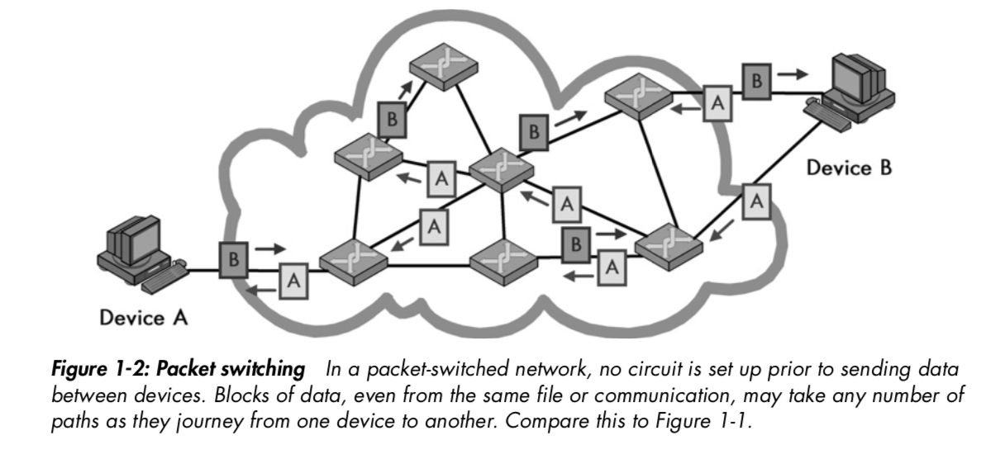

## Introduction

We will explore how computer network works?

How computers communicate with each other accross network?

How computer networks are designed and what is organization and architecture of computer network?

Which technology are used to build computer network?

What is Internet?

We can program many awesome applications over computer networks.

We can configure our networks correctly and effectively.

We can build our own networks.

Basically, a computer network is a collection of computers. They communicate to each other to form a network. The term computers are general, they maybe various devices such as PC, laptop, server computers, smartphone, TV, car, sensors, and many many other embbedded devices.

Internet is the global computer network. There are billions of devices in Internet.

Internet is very huge. Of cause, nobody or no organization can manage it alone. Internet is constructed recursively and composed of smaller parts. Therefore, the network is a recursive term. Some networks are connected together to form a bigger network - **internetwork**. Small networks are built and managed by individual organizations.

We can think about a computer network as a graph. In there, nodes are devices and edges are physical links (wire or wireless links) between these devices.

Two computers can communicate or exchange data through many physical channels and technologies:
* Wire channels: twisted pair cable, coaxial cable, optical fiber
* Wireless channels: WiFi, Bluetooth, Zigbee, Satellite

Each technology has a different way to transmission data and different bandwidth.

Bandwidth is the capacity of data exchange and measured by bits/s. For example, an Ethernet-link has bandwidth of 100Mb/s, 1Gb/s, to 10Gb/s. WiFi-link has the less bandwidth, from 10Mb/s to 1Gb/s. Don't confuse with bandwidth term in the electrical engineering that is measured in Hz to tell how width of signal frequency range support by a specific channel.

## Network characters

**Network size**

Local area network (LAN) is a network of computers typically inside a building like a home or an office. LANs are basic elements of the Internet, we will talk about they later deeply.

Wide area network (WAN) is a network that extends over a large geographic such as a city, a region.

Global network or Internet is a network of the world.

**Wire and wireless**

Computers can connect together using wire or wireless links.

Wire links use electrical signal through copper cable or optical signal (lazer or LED) to transmission data.

Wireless links use radio signal to transmission data.

**Circuit and Packet switch**

In a circuit switching network, before each communication session, a dedicated path through two devices is established and some bandwidth is saved and exists during the session and free at the end of the session. The circuit network (e.g, Telephone network) guarantees the quality of service (not interrupted, stable throughput).

In a packet switching network, data are sent through network packet by packet, hop by hop, no guarantee of the quality of service.

Circuit switching networks guarantee the quality of service but more expensive than packet switching networks. And total throughput in a packet switching network will be much more than a circuit one.

The Internet is designed as a packet switching network.

**Connection-oriented and Connectionless**

In a connection-oriented communication, a logical connection must be established between two devices before they exchange data. Collectionless fashion doesn't establish a connection between devices. As soon as a device want to send data, it just sends it.

Circuit-switched networks are inhenently based on connections. While in packet-switched networks, connections can be logical created, but are optional. We'll explore the TCP protocol as a connection-oriented protocol later.

## Network services

