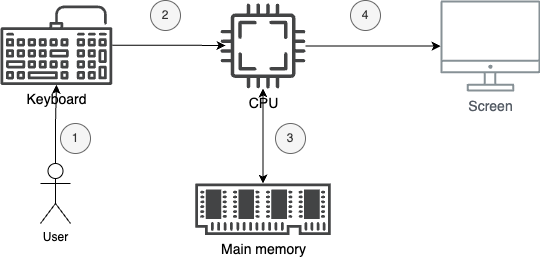

# Giới thiệu về lập trình

Nội dung:
- Cấu tạo của máy tính
- Ngôn ngữ lập trình
- Nghề lập trình

## Cấu tạo của máy tính

Thông thường, một chiếc máy tính sẽ bao gồm các bộ phận sau:
- Thiết bị đầu vào: bàn phím, chuột, ...
- Bộ vi xử lý - CPU
- Bộ nhớ chính - Main memory
- Thiết bị đầu ra: màn hình, máy in, ...

Nhiệm vụ của máy tính chính là **tính toán**. Thành phần thực hiện tính toán là **CPU** (Center Processing Unit). CPU thực hiện tính toán bằng cách đọc và xử lý các câu **lệnh** và **dữ liệu** trên bộ nhớ chính **main memory**.

Máy tính sẽ tính toán khác nhau dựa vào dữ liệu được cung cấp bởi các thiết bị đầu vào như bàn phím, chuột. Thông qua các thiết bị này, người dùng có thể điều khiển máy tính của mình.

Kết quả tính toán, xử lý sẽ được thể hiện cho người dùng thông qua các thiết bị đầu ra như màn hình.