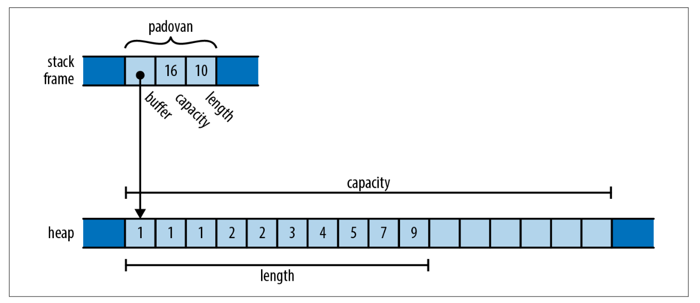
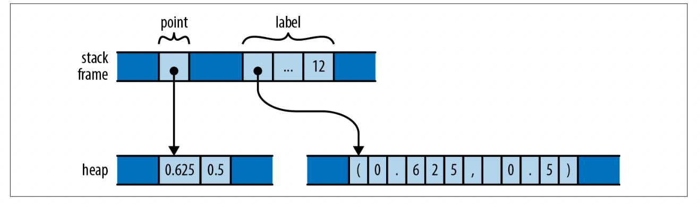
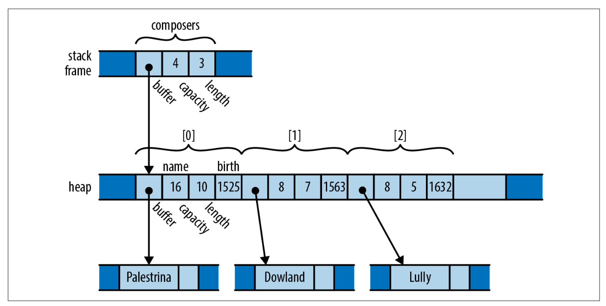
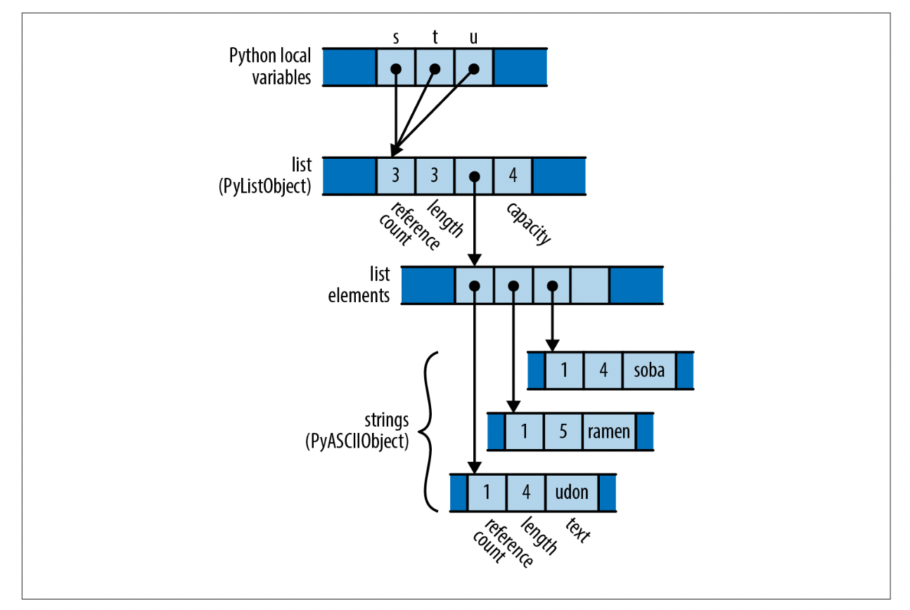
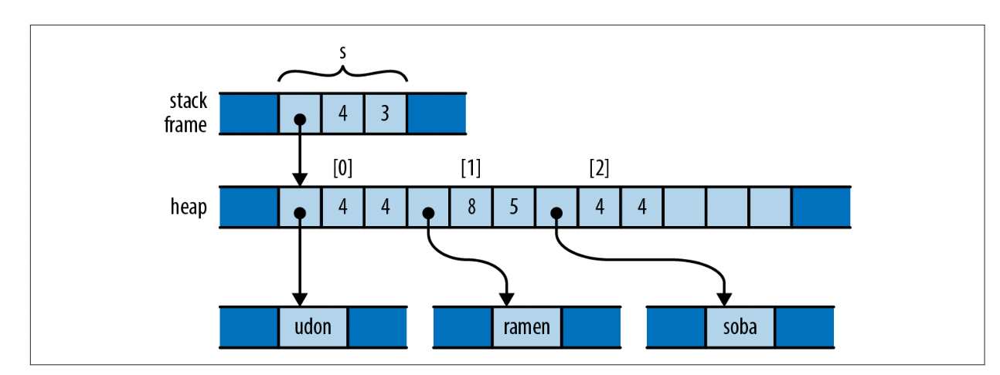
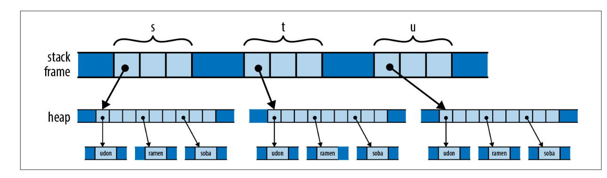
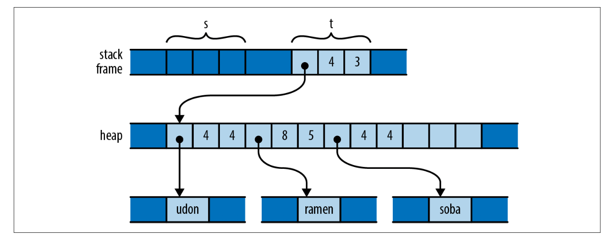
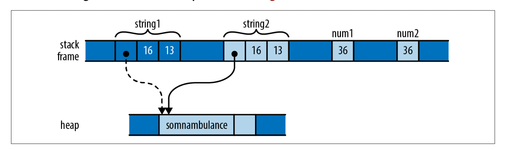
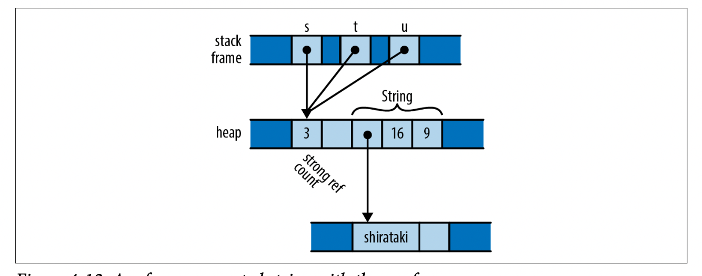

## Ownership

Every value has a single **owner** variable that determines its lifetime.

When the owner is dropped (go out of its scope), the owned value is dropped too (memory is freed).

A variable owns it value. When the variable is out of its scope, it is dropped, so its value is dropped.
For example, `Vec<T>` is a growable, heap-allocated array of values of type T.

```rust
fn print_padovan() {
    let mut padovan = vec![1,1,1]; // allocated here 
    for i in 3..10 {
      let next = padovan[i-3] + padovan[i-2];
      padovan.push(next);
    }
    println!(":?", padovan);
}                                 // dropped here    
```

The type of *padovan* variable is *Vec<i32>*. In memory, the final value of *padovan* will look like



Note that the word holding *padovan's* buffer pointer, capacity, and length live directly in the stack
frame of the *print_padovan* function; only the vector's buffer is allocated on the heap.

When the variable *padovan* goes out of scope at the end of the function, the program drops the vector.
And since the vector owns its buffer, the buffer is dropped (freed) too.

The other example is *Box<T>* type. A *Box<T>* is a pointer to a value of type T stored on the heap.
Calling `Box::new(v)` allocates some heap space, moves the value v into it, and returns a *Box* pointing
to the heap space. Since the Box owns the space it points to, when the Box is dropped, it frees the space
too.

```rust
{
  let point = Box::new((6.124, 0.5)); // point allocated here
  let label = format!("{:?}", point); // label allocated here
  assert_eq!(label, "(6.125, 0.5)");
}                                     // both dropped here
```

When the program calls `Box::new`, it allocates space for a tuple of two *f64* values on the heap, moves
its argument `(6.125, 0.5)` into that space, and returns a pointer to it. By the time control reaches the
call of *assert_eq!*, the stack frame looks like



Let's take a more complex example. Structs own their fields, and tuples, arrays, and vectors own their
elements:

```rust
struct Person { name: String, birth: i32 }

let mut composers = Vec::new();
composers.push(Person { name: "Palestrina".to_string(), birth: 1525 });
composers.push(Person { name: "Dowland".to_string(), birth: 1563 });
composers.push(Person { name: "Lully".to_string(), birth: 1632 });

for composer in &composers {
  println!("{}, born {}", composer.name, composer.birth);
}
```

In memory, the final value of *composers* looks like



It follows that the owners and their owned values form *trees*. At the root of each tree is a variable;
when the variable goes out of scope, the entire tree goes with it. We can see such an ownership tree in
the diagram for *composers*. Every value in Rust program is a member of some tree, rooted in some variable.

## Moves

In Rust, for most types, operations like assigning a value to a variable, passing it to a function, or
returning it from a function don't copy the value: they **move** it. The source passes ownership of the
value to the destination and becomes uninitalized; the destination now controls the value's lifetime, and
we cannot use the source anymore.

Let's take an example about assignment to explore the moving concept.

Consider the following Python code:

```python
s = ['udon', 'ramen', 'soba']
t = s
u = s
```

Each Python object carries a reference count, tracking the number of variables that are currently
referring to it. See the final state of the program like this figure.



Python has copied the pointer from `s` to `t` and `u` and updated the list's referenece count to 3.

Now consider the analogous C++ code:

```c++
using namespace std;
vector<string> s = { "udon", "ramen", "soba" };
vector<string> t = s;
vector<string> u = s;
```

The original value of `s` looks like the figure.



Assigning a `std::vector` produces a copy of the vector in C++, `std::string` behaves similarly.
So by the time the program reaches the end of the code, it has actually allocated 3 vectors and
nine strings.



In a sense, C++ and Python have chosen opposite trade-offs: Python makes assignment cheap, at the
expense of requiring reference counting and free memory (and in the general case, garbage collection).
C++ keeps the ownership of all the memory clear, at the expense of making assignment carry
out a deep copy of the object.

So what would the analogous program do in Rust? Here's the code:

```rust
let s = vec!["udon".to_string(), "ramen".to_string(), "soba".to_string()];
let t = s;
let u = s; 
```

Like C and C++, Rust puts string literals like "udon" in read-only memory; so for a cleare comparasion
with the C++ and Python examples, we call `to_string` here to get heap-allocated `String` values.

After carrying the initialization of `s`, Rust and C++ use similar representation for vectors and strings,


But, in Rust, assignment of most types *move* the value from the source to the destination, leaving the source
uninitialized. So after assignment of `t`, the program's memory looks like the figure.



The assigment `let t = s;` moved the vector's three header fields from `s` to `t`; now `t` owns the vector.
The compiler now consider `s` uninitialized.

So what happens when we reach the `let u = s;`? This would assign the uninitalized (moved) value `s` to `u`.
The compiler rejects this code with following error:

```str
error[E0382]: use of moved value: `s`

let s = vec!["udon".to_string(), "ramen".to_string(), "soba".to_string()];
    - move occurs because `s` has type `Vec<String>`,
      which does not implement the `Copy` trait
let t = s;
        - value moved here
let u = s;
        ^ value used here after move
```

If you want to end up in the state as C++ program, with each variable holding an independent copy of the
structure, you must call the vector's `clone` method, which performs a deep copy of the vector and its
elements:

```rust
let s = vec!["udon".to_string(), "ramen".to_string(), "soba".to_string()];
let t = s.clone();
let u = s.clone();
```

You can you re-create Python's behaviour by using Rust's reference-counted pointer types; `Rc and Arc`
(see later).

## More Operations That Move

In the examples thus far, we've shown initializations, providing values for variables as they come into
scope in a `let` statement. Assigning to a variable is slightly different, in that if you move a value
into a variable that was already initialized, Rust drops the variable's prior value. For example:

```rust
let mut s = "Govinda".to_string();
s = "Siddhartha".to_string(); // value "Govinda" dropped here
```

When the program assigns the string `"Siddhartha"` to `s`, its prior value `"Govinda"` gets dropped first.
But consider the following:

```rust
let mut s = "Govinda".to_string();
let t = s;
s = "Siddhartha".to_string(); // nothing is dropped here
```

This time, `t` has taken ownership of the original string from `s`, so that by time we assign to `s`,
it is uninitialized. In this scenario, no string is dropped.

Initializations and assignments in the examples here are simple to reason, but Rust applies move sematics
to almost any use of a value. Passing arguments to functions move ownership to the function's arguments;
returing a value from a function moves ownership to the caller. Building a tuple moves the values into the
tuple. And so on.

## Moves and Control Flow

Move sematics in control flows. The general principle is that, if a variable have had its value moved away
and it hasn't been given a new value, it's considered uninitialized.

```rust
let x = vec![10, 20, 30];
if c {
  f(x); // ... x moved to here
} else {
  g(x); // ... else x moved to here
}
h(x); // bad: x is uninitialized here if either path uses it
```

For similar reasons, moving from a variable in a loop is forbidden:

```rust
let x = vec![10, 20. 30];
while f() {
  g(x); // bad: x would be moved in first iteration,
       // uninitialized in second
}
```

That is, unless we've given it a new value by the next iteration:

```rust
let x = vec![10, 20, 30];
while f() {
  g(x);        // move from x
  x = h();    // give x a fresh value
}
e(x);
```

## Moves and Indexed Content

We've mentioned that a move leaves a source initialized, as the destination takes ownership of the value.
But not every kind of value owner is prepared to become initialized. For example:

```rust
// Build a vector of the strings "101", "102", ... "105"
let mut v = Vec::new();
for in in 101 .. 106 {
  v.push(i.to_string());
}

// Pull out random relements from the vector.
let third = v[2]; // error: Cannot move out of index of Vec
let fifth = v[4]; // here too
```

Atfer move to variable `third` and `fifth`, `v[2]` and `v[4]` become uninitalized. But in Rust, it rejects
making some elements of a vector (other collection type too) uninitialized. The compiler will show an error:

```sh
error[E0507]: cannot move out of index of `Vec<String>`
|
|    let third = v[2]
|                ^^^^ 
|                |
|                 move occurs because value has type `String`,
|                 which does not implement the `Copy` trait
|                 help: consider borrowing here: `&v[2]`
```

In the error message, Rust suggests using a reference, in case you want to access the element without moving it.
But if you really want to move an element out of a vector? You need to find a method that does so with limitations
of the type. Here are three possibilities:

```rust
let mut v = Vec::new();
for i in 101 .. 106 {
  v.push(i.to_string());
}

// 1. Pop a value off the end of the vector:
let fifth = v.pop().expect("vector empty!");
assert_eq!(fifth, "105");

// 2. Move a value out of a given index in the vector,
// and move the last element into its spot:
let second = v.swap_remove(1);
assert_eq!(second, "102");

// 3. Swap in another value for the one we're taking out:
let third = std::mem:replace(&mut v[2], "substitute".to_string());
assert_eq!(third, "103");

// Lets's see what's left of our vector
assert_eq!(v, vec!["101", "104", "subtitute"]);
```

Collection types like *Vector* also generally offer methods to consume all their elements in a loop:

```rust
let v = vec!["morning".to_string(), "noon".to_string(), "evening".to_string()];

for mut s in v {
  s.push('!');
  println!("{}", s);
}    
// v is uninitialized here
```

When we pass the vector to the loop directly, as in `for ... in v`, this *moves* the vector out of `v`,
leaving *v* uninitialized. The `for` loop's internla machinery takes ownership of the vector and disseccts
it into its elements. At each iteration, the loop moves another element to the variable `s`. And since
`s` now owns the string, we're able to modify it in the loop body before printing it.

## Copy Types: The Exception to Moves

We've shown of values being moved involve vectors, strings, and other types that could use a lot of memory
and be expensive to copy. Moves keep ownership of such types clear and assignment cheap. But for simpler
types like integers or characters, moving is not cheaper, so Rust decides to copy values. Compare what happens
in memory when we assign a `String` with what happens when we assign an `i32` value:

```rust
let string1 = "somnabulance".to_string();
let string2 = string1;

let num1: i32 = 36;
let num2 = num1;
```

After running this code, memory looks like:



Assignment *moves* `string1` to `string2`. However, the situation with `num1` and `num2` is different.
We've made a completely independent copy of `num1`. We call integer is a **Copy** type.

In Rust, assigning a value of a **Copy** type copies the value, rather than moving it. The source stays
as same as it before. Passing **Copy** types to functions and constructors behaves similarly.

The standard **Copy** types include all the machine integer and floating-point numeric types, the *char*
and *bool* types. A tuple or fixed-size array of **Copy** types is itself **Copy** type.

To make your own type as a Copy type by **derive** 

```rust
#[derive(Copy, Clone)]
struct Point { x: f32, y: f32 }

fn print_point(p: Point) { println!("Point: ({}, {})", p.x, p.y); }

let p = Point { x: 10.2, y: 12.5 };
// Now we can pass a copy of p to function
print_point(p);
// And use it later
println!("Point here: ({}, {})", p.x, p.y);
```

We can visit **Copy** type more on https://doc.rust-lang.org/std/marker/trait.Copy.html

## Rc and Arc: Shared Ownership

Although most values have unique owners in typical Rust code, in some case you'd like
the value has multiple owners and it lives until all of it's owners dropped. Rust provide
the reference-counted pointer types `Rc` and `Arc`.

The `Rc` and `Arc` are very similar; the only different is that `Arc` is safe to share
between threads directly - the name `Arc` is *atomic reference count* - whereas `Rc` is
non-thread safe.

Python uses reference counts to manage its values' lifetimes. You can use `Rc` to get a
similar effect in Rust.

```rust
use std::rc::Rc;

// Rust can infer all these types; written out for clarity
let s: Rc<String> = Rc::new("shirataki".to_string());
let t: Rc<String> = s.clone();
let u: Rc<String> = s.clone();
```

For any type `T`, an `Rc<T>` value is a pointer to a heap-allocated `T` that has
a reference count affixed to it. Cloning an `Rc<T>` value does not copy the `T`;
instead, it creates another pointer to it and increases the reference count.



A value owned by an `Rc` pointer is immutable. Suppose you try to do:

```rust
s.push_str(" noodles");
```

Rust will decline:

```txt
error: cannot borrow data in an `Rc` as mutable
      --> ownership/ownership_rc_mutability.rs:13:5
      |
      |     s.push_str(" noodles");
      |     ^ cannot borrow as mutable
```
