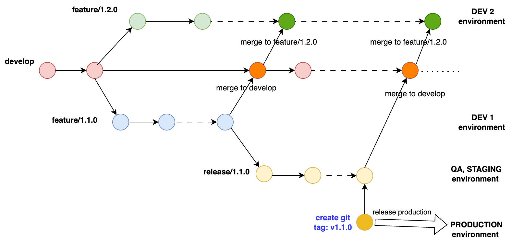

# Mô hình quản lý version semantic

Dự án thường được phát hành (release) theo **semantic version**.

Một version của dự án sẽ được gán một **semantic version** number **MAJOR.MINOR.PATCH**. Xem ví dụ dưới đây để hiểu về cách gán **semantic version** cho dự án.

| Code status | Giai đoạn | Rule | Example |
|-------------------| -----------------------|-------------------------|------|
| Lần phát hành đầu | Phát hành sản phẩm mới | Bắt đầu với 1.0.0 | 1.0.0|
| Backward compatible bug fixes | Patch release | Tăng số thứ ba | 1.0.1 |
| Backward compatible new features | Minor release | Tăng số thứ hai và reset số thứ ba về 0 | 1.1.0 |
| Changes that break backward compatibility | Major release | Tăng số thứ nhất và reset số thứ hai, thứ ba về 0 | 2.0.0 |

Trong đó:

- **Backward compatible**: nghĩa là thay đổi nhưng không phá vỡ tính tương thích của sản phẩm như API, Interface, cấu trúc dữ liệu cơ bản, ... Cái này không có quy ước cụ thể mà phải dựa thêm vào đánh giá của người phát triển dự án. `Minor` và `patch` releases sẽ đảm bảo tính `backward compatible`.
- **Major release**: nghĩa là có sự thay đổi lớn, làm phá vỡ tính tương thích của sản phẩm.

Tham khảo:

- https://docs.npmjs.com/about-semantic-versioning
- https://semver.org/

Vậy việc quản lý source code, cụ thể là dùng git, sẽ được diễn ra như thế nào?

## Git flow cho semantic version

Với mỗi version, sẽ có một nhánh (branch) code tương ứng được tách ra từ nhánh chính. Nhánh chính thường được đặt tên là `develop`, `main`, `master`, ... 
Các nhánh version có nhiều cách đặt tên, tùy theo quy ước của từng dự án, ví dụ như:

- `1.0.0`, `feature/1.0.0`, `branch-1.0.0`, ...

Có thể hình dung các nhánh version là cái xương nhỏ của con cá được tách từ nhánh chính là cái xương sống. 

{width="500px"}

\pagebreak

Thông thường các dự án sẽ lập kế hoạch theo từng version **minor**. Nhiều version **minor** có thể được phát triển cùng một lúc, version gần nhất sẽ được ưu tiên lên kế hoạch hoàn thành sớm nhất.
Với mỗi version đều có các giai đoạn phát triển như `coding and feature test`, `integration test`, `staging test` sau đó là việc `release version`.

- **Coding and feature test**: Trong giai đoạn này là đội developers, testers sẽ cùng nhau code và test từng chức năng của version. Môi trường test thường được gọi là `DEV env`.
- **Integration test**: Đội testers (có thể là đội khác như QA) thực hiện test tích hợp tất cả chức năng của version trên môi trường tích hợp, thường hợp là `QA env`.
- **Staging test**: Trước khi phát hình sản phẩm, source code sẽ được triển khai (deploy) lên một môi trường giống nhất với môi trường production gọi là `STAGING env` để test tích hợp và test hệ thống.
- **Release version**: Sau khi test trên môi trường staging, đội phát triển sẽ bổ sung thêm thông tin cần cho việc phát hành sản phẩm như release notes, hướng dẫn còn thiếu, thông tin version, ... Sau đó nhánh version sẽ được deploy lên môi trường production `PROD env` hay gọi là go line.

Một rule thường được áp dụng là **không test cùng lúc nhiều version trên cùng một môi trường**. 

- Như vậy nếu có kế hoạch phát triển bao nhiêu version cùng một lúc thì nên có bấy nhiêu môi trường `DEV env`. 
- Số lượng môi trường `QA env` và `STAGING env` có thể ít hơn. 

Tiếp theo chúng ta xem một quy trình phát triển một version **minor** sẽ như thế nào.

\pagebreak

## Phát triển một version minor.

Tùy vào dự án, một verion **minor** sẽ được lên kế hoạch phát triển trong vài tháng. Nhánh code cho version `minor` sẽ được tách trực tiếp từ nhánh chính, ví dụ `feature/1.0.0`, `feature/1.1.0`, ...

- Từ nhánh code version này sẽ được tách ra nhiều các nhánh khác nhau để phát triển các chức năng cho version.
- Trong quá trình này, nhánh code version sẽ được triển khai (deploy) lên môi trường `DEV env` để nhóm phát triển thực hiện test các chức năng của version.
- Sau khi nhánh code version được phát triển và test xong thì sẽ tách ra một nhánh `release` (ví dụ `release/1.1.0`) để triển khai lên môi trường `QA env` để test tích hợp và sửa lỗi nếu có.
- Kết thúc test trên `QA env`, nhánh `release` sẽ được deploy lên môi trường `STAGING env` để test và chuẩn bị release production.

{width="500px"}

Hình vẽ trên mô tả luồng git khi phát triển một version **minor**, các điểm lưu ý:

- Khi giai đoạn `coding and feature test` kết thúc, thực hiện **merge** nhánh version vào nhánh chính (develop), sau đó merge nhánh chính (develop) vào các nhánh version cao hơn đang phát triển, ví dụ như `feature/1.2.0`, ...
- Trong giai đoạn `integration test` và `staging test`, nếu có lỗi:
   - Tách code từ nhánh `release/1.1.0` để sửa.
   - Merge code sửa `feature/1.1.0` để thực hiện test trên môi trường `DEV env`.
   - Sau code sửa vào nhánh `release/1.1.0` để thực hiện test trên môi trường `QA` hay `STAGING` (tùy thời điểm đó được deploy lên STAGING hay chưa).
- Kết thúc test trên môi trường `STAGING`, thực hiện cập nhật release note, các tài liệu cần thiết và đánh tag (Git tag, ví dụ **v1.1.0**).
   - Merge nhánh `release/1.1.0` vào nhánh chính (develop), sau đó merge nhánh chính (develop) vào các nhánh version cao hơn đang phát triển.
   - Sau khi hoàn thành các công việc chuẩn bị khác, thực hiện triển khai (deploy) version lên môi trường `PROD env`, code của version lấy từ Git tag **v1.1.0**. Như vậy mỗi một `Git tag` sẽ `đại diện` cho một version production.
   - Lúc này, các môi trường `DEV`, `QA` và `STAGING` có thể được dùng cho việc test các version khác.

\pagebreak  

## Xử lý lỗi sau khi release version (PATCH fix)

Sau khi một version đã được release production, nếu có lỗi xảy ra thì thực hiện:

- Tách một nhánh từ Git tag của version (`v1.1.0`), ví dụ tên nhánh là `release/1.1.1` (tăng number **patch** lên một). 
- Sửa các lỗi phát hiện, thực hiện test trên môi trường `DEV`, `STAGING`, sau đó thực hiện tạo Git tag cho version sửa lỗi, gọi là **PATCH** version, ví dụ `v1.1.1`. 
- Cuối cùng là deploy tag `v1.1.1` lên môi trường production `PROD`.

{width="500px"}


## Tham khảo

Sematic version:

- https://docs.npmjs.com/about-semantic-versioning
- https://semver.org/

Git tag:

- https://git-scm.com/book/en/v2/Git-Basics-Tagging

Tạo Git tag (thường là `annotated tag`) đơn giản bằng command sau:

```sh
git tag -a v1.0.0 -m "my version 1.0.0"
```
