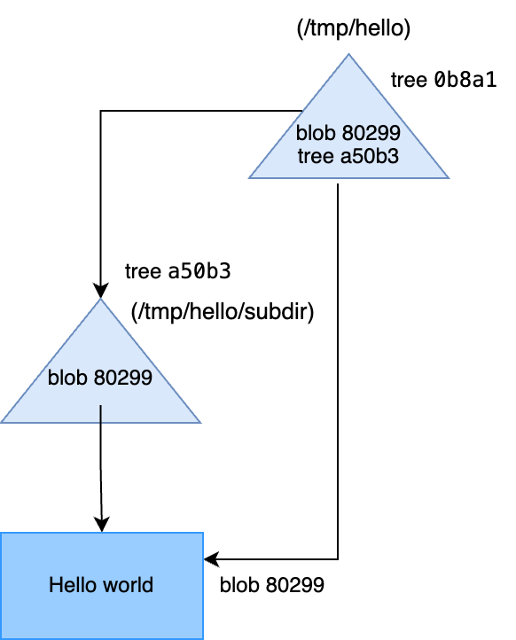
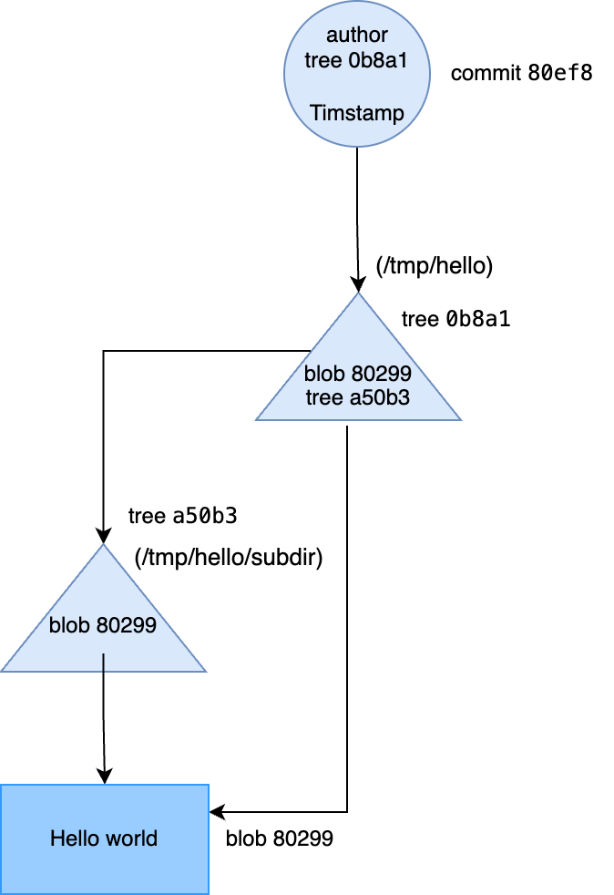

# Git Internals

Date: 8 Dec, 2029

## Mở đầu

**Git internals** là cơ chế hoạt động và cấu trúc dữ liệu được sử dụng để tạo nên hệ quản lý version của Git. Hiểu được **Git internals** sẽ giúp chúng ta sử dụng Git một cách hiệu quả nhất.

Lưu ý, bài viết này không dành cho người mới sử dụng Git. Với ai chưa làm việc với Git, có thể tham khảo trước bài hướng dẫn cơ bản về Git:
- https://git-scm.com/book/en/v2/Git-Basics-Getting-a-Git-Repository

## Git init

Để tạo một repository mới, chúng ta run `git init` trong một directory mới hoặc directory có sẵn. Và Git sẽ tạo một thư mực `.git`, nơi mà Git lưu trữ và thao tác mọi thông tin dùng để quản lý version. Khi cần backup một repository, bạn chỉ cần copy folder này sang nơi cần backup.

Một thư mục `.git` mới tạo sẽ trông như sau:

```
.git
├── HEAD
├── config
├── description
├── hooks
│   ├── ...
├── info
│   └── exclude
├── objects
│   ├── info
│   └── pack
└── refs
    ├── heads
    └── tags
```

File `description` được dùng bởi GitWeb program, chúng ta tạm thời chưa cần quan tâm đến nó. File `config` chứa các cấu hình dành riêng cho project, và thư mục `info` chứa global ignored patterns mà chúng ta không muốn khai báo trong file `.gitignore`. Thư mục `hooks` chứa các hook scripts. Liên quan đến **Git Hooks**, chúng ta sẽ tìm hiểu ở một bài viết riêng.

Còn lại 4 mục quan trọng mà Git lưu trữ thông tin:
- Thư mục `objects` lưu trữ mọi nội dụng của projects, chúng ta có thể hiểu là các file source code và cấu trúc thư mục của project.
- Thư mục `refs` lưu các pointers trỏ tới các commit objects, ở đây là branches, tags, remotes.
- `HEAD` file trỏ đến branch đang được checked out.
- `index` file là nơi Git lưu thông tin staging area. Khi mới tạo repo thì chưa có file này.

## Git Objects

Một Git repository sẽ có 2 loại components chính:
- Tập hợp các `objects` - **blobs**, **trees**, and **commits**.
- Hệ thống naming các `objects` này - gọi là **references**.

Thử tìm hiểu xem git object được tạo ra như thế nào. Hãy tạo một file *hello.txt* và staged nó trong index (staging area) bằng lệnh `git add`.

```
# Tạo file hello.txt và thêm vào staging area thông qua git add
$ echo "Hello world" > hello.txt
$ git add hello.txt
```

Thư mục `objects` sẽ trông như sau:

```
.git/objects
.git/objects/80
.git/objects/80/2992c4220de19a90767f3000a79a31b98d0df7
.git/objects/info
.git/objects/pack
```

Git đã làm gì đằng sau câu lệnh `git add hello.txt`, nó lấy ra nội dung của file hello.txt gọi là **blob** và tính mã hash SHA1 của nội dung này. Kết quả SHA1 hash là một chuỗi 160 bits được rendered bằng 40 ký tự hexa `802992c4220de19a90767f3000a79a31b98d0df7`, git cắt 2 ký tự đầu làm thư mục, và lưu nội dung của **blob** vào file với tên của phần SHA1 hash còn lại là `2992c4220de19a90767f3000a79a31b98d0df7`.

Bạn có thể extract nội dung của object nếu biết mã hash của nó bằng cách sử dụng một lệnh low-level:

```
# Sử dụng lệnh git cat-file
$ git cat-file -p 802992c4220de19a90767f3000a79a31b98d0df7
Hello world
```

Hoặc là

```
# Dùng git hash-object để generate mã SHA1 từ nội dung blob
$ echo "Hello world" | git hash-object --stdin
802992c4220de19a90767f3000a79a31b98d0df7
```

> Dành cho các bạn chưa biết về SHA1, nó là một thuật toán trong mật mã. ?Nó đảm bảo rằng sẽ rất rất khó có thể xảy ra trường hợp 2 blobs khác nhau cho ra cùng một mã SHA1 hash. Tham khảo thêm [Wikipedia](https://en.wikipedia.org/wiki/SHA-1).

40 ký tự của mã SHA1 là khá dài để typing, bạn không cần thiết phải cung cấp đủ 40 ký tự này mà chỉ cần dùng prefix, với project thông thường là 7 ký tự ban đầu, và Git đủ thông minh để biết bạn đang dùng mã SHA1 nào. Để kiểm chứng tính đúng đắn, bạn có thể dùng lệnh `git rev-parse`. Tham khảo thêm [Revision selection](https://git-scm.com/book/en/v2/Git-Tools-Revision-Selection#Short-SHA-1)

```
$ git cat-file -p 802992c
Hello world
$ git rev-parse 802992c
802992c4220de19a90767f3000a79a31b98d0df7
```

Như ví dụ trên, chúng ta đã tạo một **blob** object trong Git bằng lệnh `git add <filename>`. Chúng ta cũng có thể tạo một **blob** object trực tiếp từ nội dung mà không cần `git add`.

```
# Sử dụng hash-object -w để tạo blob object
$ echo "Git is a distributed version control system" | git hash-object --stdin -w
73b741ca02dc821d2e826ff1904afff03ad4cc1d
```

Lúc này trong `.git/objects` sẽ có 2 files

```
.git/objects
.git/objects/73
.git/objects/73/b741ca02dc821d2e826ff1904afff03ad4cc1d
.git/objects/80
.git/objects/80/2992c4220de19a90767f3000a79a31b98d0df7
.git/objects/info
.git/objects/pack
```

Chúng ta đã biết Git lưu nội dung các file trong **blob** objects, nhưng các files thường được tổ chức theo các thư mục, làm thế nào để Git thể hiện đường dẫn tới file trong một thư mục? Hãy đi đến mục tiếp theo **Tree object and files**.

## Tree objects và Files

Git tracks (lưu vết, theo dõi, bla bla ...) đường dẫn của files thông qua một kiểu object khác gọi là **tree** objects. Khi bạn sử dụng `git add`, Git tạo ra một **blob** object cho mỗi nội dung của từng file bạn add, nhưng nó không tạo ngay một tree object tương ứng. Thay vào đó, nó cập nhật **index**. Index được lưu trong file `.git/index` và lưu thông tin (track) đường dẫn của các files cũng như các blobs tương ứng. Mỗi lần bạn run `git add, git rm, git mv`, Git sẽ cập nhật file index với thông tin đường dẫn và blob mới.

Bất kỳ khi nào muốn, bạn có thể tạo một tree object từ index hiện tại bằng cách capture (chụp) một snapshot (phiên bản) của thông tin hiện tại của index với lệnh low-level `git write-tree`.

Hiên tại, index chỉ chứa một file là `hello.txt`. Sử dụng lệnh [git ls-files](https://git-scm.com/docs/git-ls-files) để xem thông tin của file index.

```
$ git ls-files -s
100644 802992c4220de19a90767f3000a79a31b98d0df7 0	hello.txt
```

Bạn có thể thấy sự liên kết của file, `hello.txt`, và blob `802992c...`. Tiếp theo, hãy capture trạng thái của index và lưu nó trong một tree object.

```
$ git write-tree
a50b30eb6b223aef893c367a0b93e9a5b21f155f

$ find .git/objects
.git/objects
.git/objects/a5
.git/objects/a5/0b30eb6b223aef893c367a0b93e9a5b21f155f
.git/objects/pack
.git/objects/73
.git/objects/73/b741ca02dc821d2e826ff1904afff03ad4cc1d
.git/objects/80
.git/objects/80/2992c4220de19a90767f3000a79a31b98d0df7
.git/objects/info
```

Now, chúng ta có thêm một object mới, tree object `a50b30e`. Nhưng nội dung được lưu trữ trong tree object này là gì?

```
$ git cat-file -p a50b30e
100644 blob 802992c4220de19a90767f3000a79a31b98d0df7	hello.txt
```

Nội dung của tree object trên được dịch như sau:
- 100644 là thuộc tính của file, nếu bạn dùng `chmod` command của Unix thì bạn sẽ biết nó có ý nghĩa gì.
- 802992c là tên của blob object.
- hello.txt là tên file gán với blob object.

## Tree Hierarchies

Ví dụ phần trước là khi chúng ta chỉ có một file, nhưng trong thực tế, project sẽ chứa cấu trúc thư mục phức tạp, nested. Hãy thử tạo một subdirectory (thư mục con) và nó chứa một file hoàn toàn giống với file `hello.txt` để xem Git handle như thế nào.

```
$ mkdir subdir
$ cp hello.txt subdir/
$ git add subdir/hello.txt
$ git write-tree
0b8a1d36a939190d39e824a426d5cbc626f3f034
```

```
$ git cat-file -p 0b8a1d3
100644 blob 802992c4220de19a90767f3000a79a31b98d0df7	hello.txt
040000 tree a50b30eb6b223aef893c367a0b93e9a5b21f155f	subdir
```

Top-level tree mới chứa 2 items: file `hello.txt` ban đầu và một subdirectory, cái này thuộc loại `tree` chứ không phải là `blob`. Một điểm đáng chú ý là mã hash SHA1 (tên) của `subdir` tree object `a50b30e` trùng với mã hash của tree object ở ví dụ trước (Cmd + F thử mà xem). Đây không phải là ngẫu nhiên mà là kết quả của một `function` (hàm) theo đúng nghĩa toán học, `subdir` giống với folder cha ở ví dụ trước, chỉ chứa đúng một file `hello.txt` với cùng nội dung "Hello world", vì thế mã hash SHA1 của nó cũng sẽ giống mã của top-level tree object lúc trước.

Để dễ hình dung thì cấu trúc tree trong Git có thể được mô tả như hình vẽ bên dưới.



## Commit Objects

Loại object tiếp theo sẽ thảo luận là **commit**.

Chúng ta có thể tạo commit object bằng cách dùng lệnh low-level `git commit-tree <tree-hash> -m <commit message>`.

```
$ git commit-tree 0b8a1d3 -m "Commit hello.txt"
80ef8119dc3e14f14fa05163638a6accca0b3064
```

Let's see nội dung của commit là gì bằng cách sử dụng `git cat-file -p`

```
$ git cat-file -p 80ef8
tree 0b8a1d36a939190d39e824a426d5cbc626f3f034
author minhnt <minhnt@nal.vn> 1733674686 +0700
committer minhnt <minhnt@nal.vn> 1733674686 +0700

Commit hello.txt
```

Commit object sẽ chứa thông tin:
- tên (mã hash) của tree object nó trỏ đến.
- thông tin thời gian tạo và người commit.

Commit object được thể hiện trong `tree hierarchy` như sau:



Trong thực tế, bạn có thể bỏ qua 2 commands `write-tree` và `commit-tree` trong ví dụ trên. Bạn chỉ cần dùng câu lệnh `git commit` là đủ, Git sẽ tự tạo **tree** object từ index và tạo một **commit** object trỏ đến tree object này, kèm theo thông tin commit như author, timestamp, và comment. 

Để xem thông tin của một commit, bạn có thể dùng lệnh `git show <commit-hash>` (trên terminal sẽ hiển thị thêm màu sắc).

```
$ git show 80ef8
commit 80ef8119dc3e14f14fa05163638a6accca0b3064
Author: minhnt <minhnt@nal.vn>
Date:   Sun Dec 8 23:18:06 2024 +0700

    Commit hello.txt

diff --git a/hello.txt b/hello.txt
new file mode 100644
index 0000000..802992c
--- /dev/null
+++ b/hello.txt
@@ -0,0 +1 @@
+Hello world
diff --git a/subdir/hello.txt b/subdir/hello.txt
new file mode 100644
index 0000000..802992c
--- /dev/null
+++ b/subdir/hello.txt
@@ -0,0 +1 @@
+Hello world
```

## Tag Objects

Object còn lại mà Git quản lý là **Tag**. Git hỗ trợ hai loại tags là `lightweight` và `annotated`.

`Lightweight tags` đơn giản là references tới commit object. Lightweight tags không được lưu trữ cứng (permanant) trong object store của Git.

Một `annotated tag` được lưu trữ dưới dạng một object. Nó 